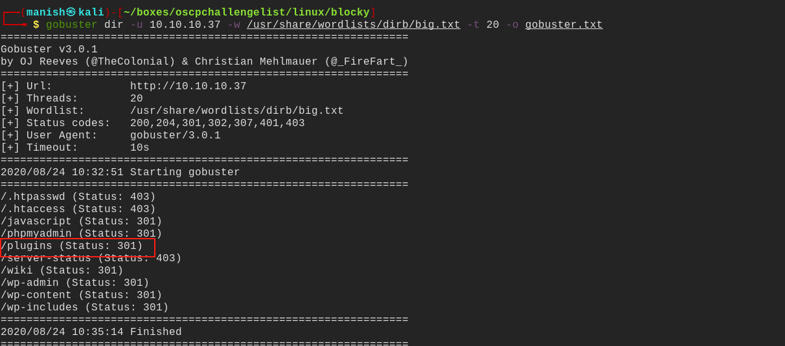
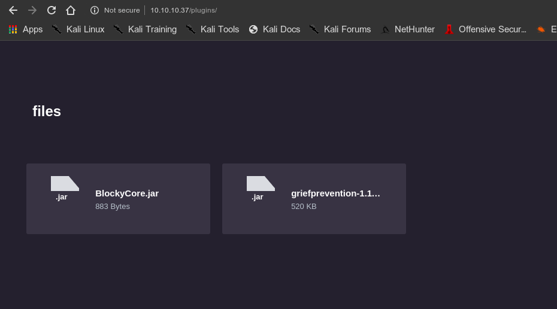
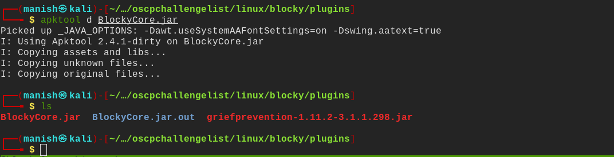
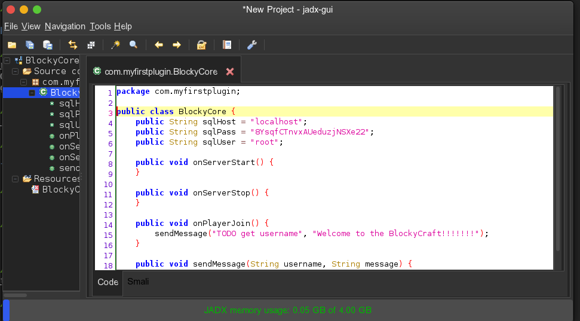
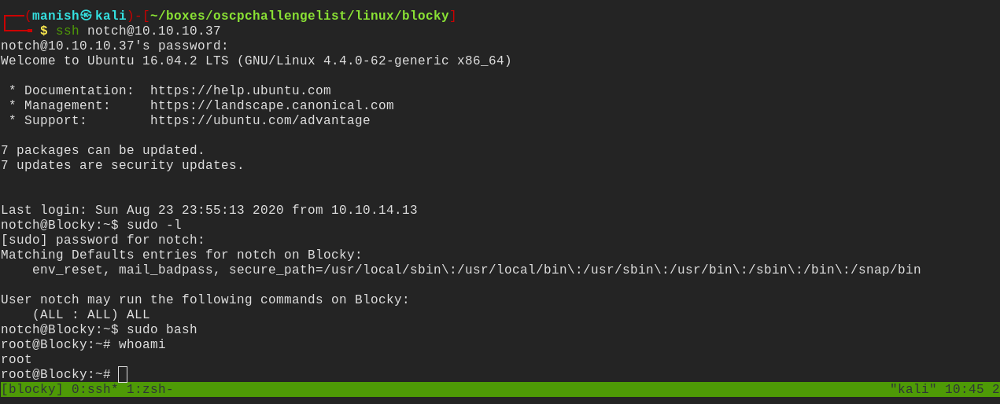

# notch

## nmap

PORT     STATE  SERVICE VERSION
21/tcp   open   ftp     ProFTPD 1.3.5a
22/tcp   open   ssh     OpenSSH 7.2p2 Ubuntu 4ubuntu2.2 (Ubuntu Linux; protocol 2.0)
| ssh-hostkey: 
|   2048 d6:2b:99:b4:d5:e7:53:ce:2b:fc:b5:d7:9d:79:fb:a2 (RSA)
|   256 5d:7f:38:95:70:c9:be:ac:67:a0:1e:86:e7:97:84:03 (ECDSA)
|_  256 09:d5:c2:04:95:1a:90:ef:87:56:25:97:df:83:70:67 (ED25519)
80/tcp   open   http    Apache httpd 2.4.18 ((Ubuntu))
|_http-generator: WordPress 4.8
|_http-server-header: Apache/2.4.18 (Ubuntu)
|_http-title: BlockyCraft &#8211; Under Construction!
8192/tcp closed sophos
Service Info: OSs: Unix, Linux; CPE: cpe:/o:linux:linux_kernel

## gobuster

- interesting directory plugins

## jar

- found 2 jar files

#### apktools

- extracted jar file using apktools
- now we need to open these files in a decompiler jadx or jadx-gui

#### jadx-gui

- got the credentials
- it is credentials for user notch

## shell and root

- got user then using sudo -l
- we have all privileges with sudo command

