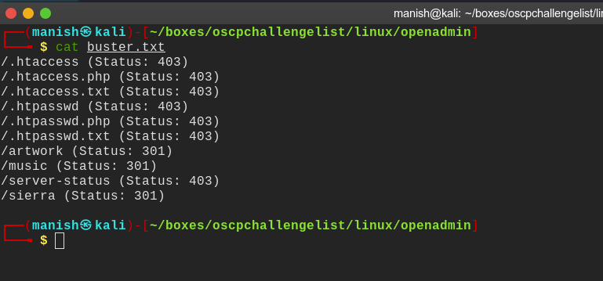
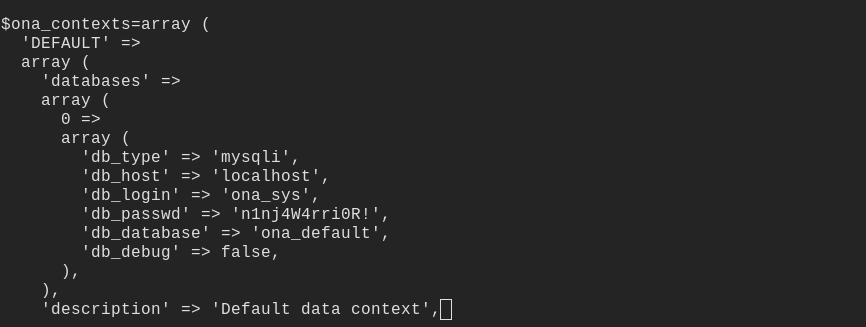
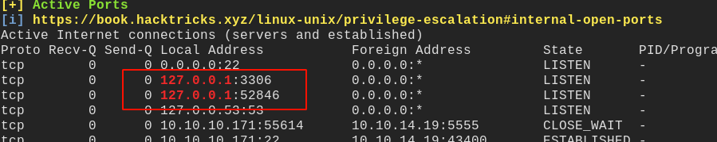
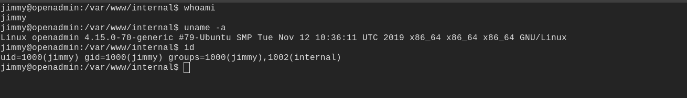
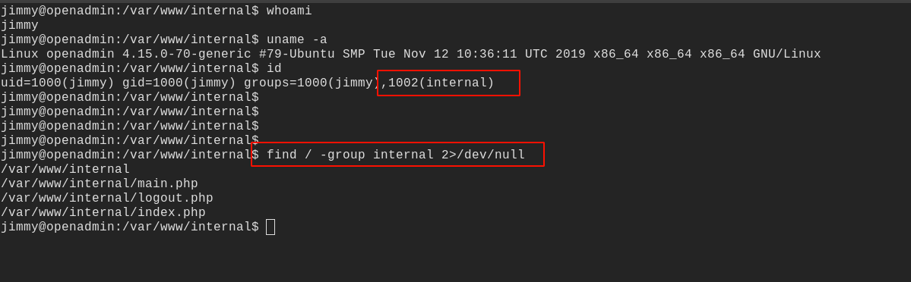
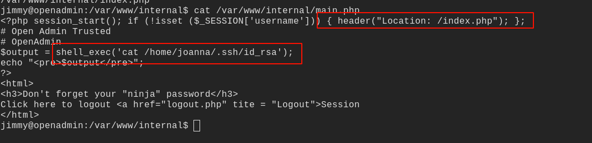
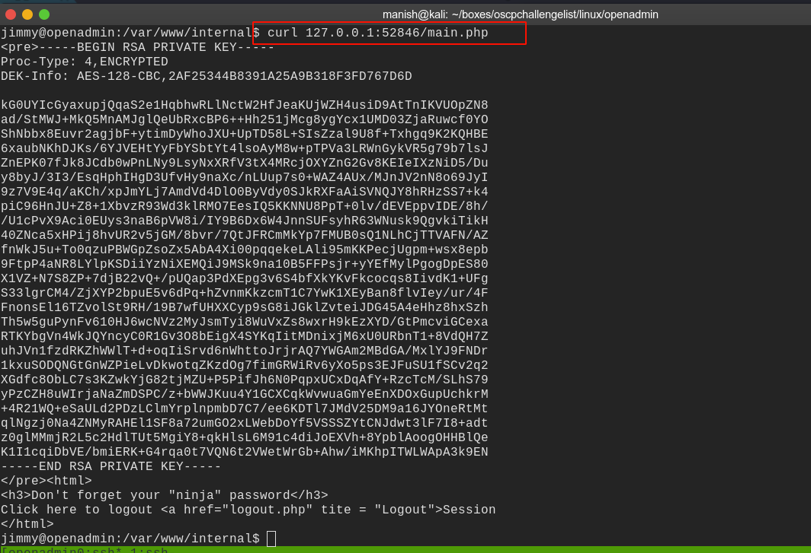
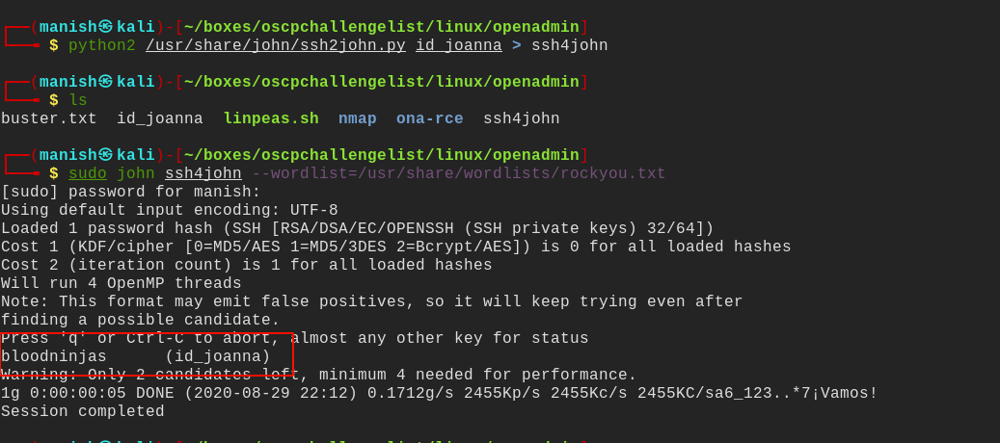
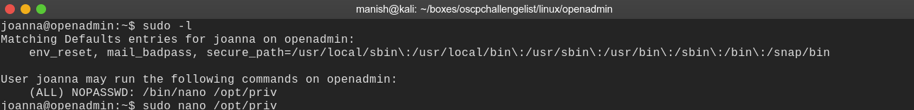
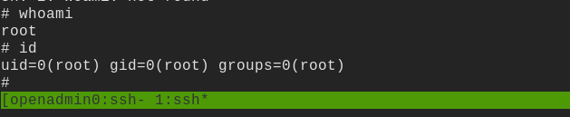

# openadmin

## nmap

PORT   STATE SERVICE VERSION
22/tcp open  ssh     OpenSSH 7.6p1 Ubuntu 4ubuntu0.3 (Ubuntu Linux; protocol 2.0)
| ssh-hostkey: 
|   2048 4b:98:df:85:d1:7e:f0:3d:da:48:cd:bc:92:00:b7:54 (RSA)
|   256 dc:eb:3d:c9:44:d1:18:b1:22:b4:cf:de:bd:6c:7a:54 (ECDSA)
|_  256 dc:ad:ca:3c:11:31:5b:6f:e6:a4:89:34:7c:9b:e5:50 (ED25519)
80/tcp open  http    Apache httpd 2.4.29 ((Ubuntu))
|_http-server-header: Apache/2.4.29 (Ubuntu)
|_http-title: Apache2 Ubuntu Default Page: It works
Service Info: OS: Linux; CPE: cpe:/o:linux:linux_kernel

## gobuster

- music subpage has a login in page that takes us to opennetadmin version 18.1.1
- there is RCE vulnerability which we can exploit to get a shell as www-data
- then enumerating the configuration file we get a password of one of the user

#### credentials

username			jimmy

password			 n1nj4W4rri0R!

- we can ssh into the server

## shell

- we see on local server mysql and someother service is running

- found we are in a interesting group called internal

- we find a files and folders belonging to group internal

- it looks like a webserver which wants us to request for index.php
- and it will give us ssh key of joanna

- we will use curl to request for the webpage
- we know there was something unusual running let try to curl it

- now we have ssh key encrypted we can use john to decrypt it

- paraphrase is **bloodninjas**

## post

- using ssh we login as joanna and see it running nano as sudo
- we can use it privesc using gtfo commands on nano

