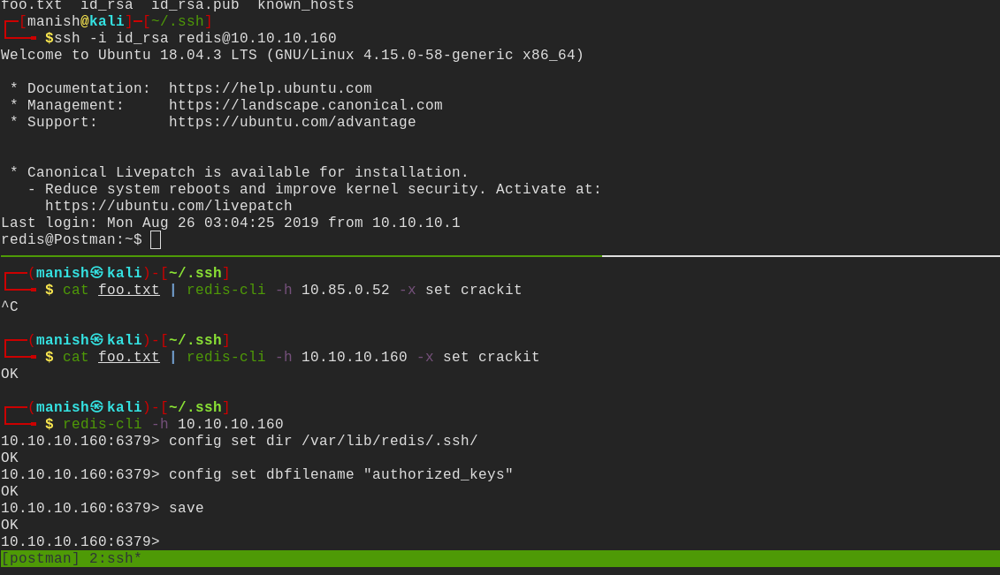
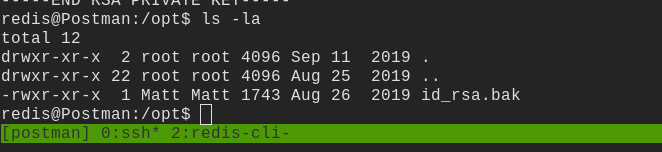
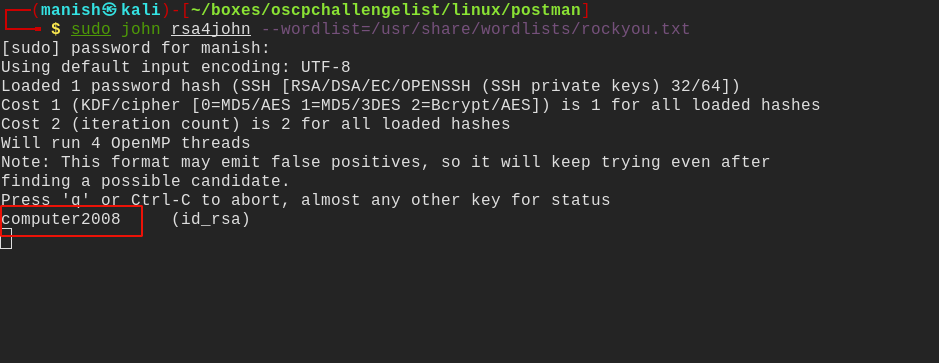
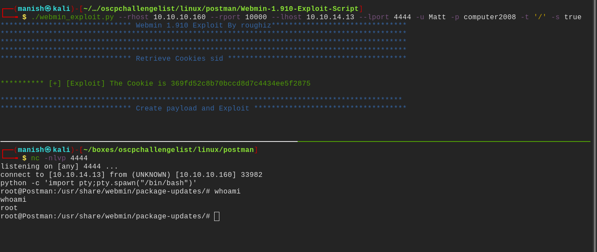

# postman

## nmap

PORT      STATE SERVICE VERSION                                                                                                        
22/tcp    open  ssh     OpenSSH 7.6p1 Ubuntu 4ubuntu0.3 (Ubuntu Linux; protocol 2.0)                                                   
| ssh-hostkey:                                                                                                                         
|   2048 46:83:4f:f1:38:61:c0:1c:74:cb:b5:d1:4a:68:4d:77 (RSA)                                                                         
|   256 2d:8d:27:d2:df:15:1a:31:53:05:fb:ff:f0:62:26:89 (ECDSA)                                                                        
|_  256 ca:7c:82:aa:5a:d3:72:ca:8b:8a:38:3a:80:41:a0:45 (ED25519)                                                                      
80/tcp    open  http    Apache httpd 2.4.29 ((Ubuntu))                                                                                 
|_http-server-header: Apache/2.4.29 (Ubuntu)                                                                                           
|_http-title: The Cyber Geek's Personal Website                                                                                        
10000/tcp open  http    MiniServ 1.910 (Webmin httpd)     

## redis

#### hackingarticlez

- followed steps on the book to write a ssh authorized key to get access
- [link](https://book.hacktricks.xyz/pentesting/6379-pentesting-redis)

## post

- id_rsa.bak file found in /opt/ folder
- now we can use it to login as Matt the other user

#### john

- it is encrypted so we need to decrypt it

- still cannot login as matt for some reason
- using paraphrase as password to switch user in current tty session
- the credentials also work on webmin 1.910 vulneralble to authenticated rce

#### root

