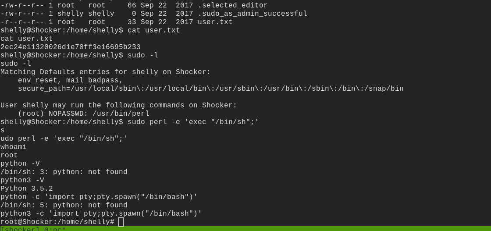

# shocker

## nmap

PORT     STATE SERVICE VERSION
80/tcp   open  http    Apache httpd 2.4.18 ((Ubuntu))
|_http-server-header: Apache/2.4.18 (Ubuntu)
|_http-title: Site doesn't have a title (text/html).
2222/tcp open  ssh     OpenSSH 7.2p2 Ubuntu 4ubuntu2.2 (Ubuntu Linux; protocol 2.0)
| ssh-hostkey: 
|   2048 c4:f8:ad:e8:f8:04:77:de:cf:15:0d:63:0a:18:7e:49 (RSA)
|   256 22:8f:b1:97:bf:0f:17:08:fc:7e:2c:8f:e9:77:3a:48 (ECDSA)
|_  256 e6:ac:27:a3:b5:a9:f1:12:3c:34:a5:5d:5b:eb:3d:e9 (ED25519)
Service Info: OS: Linux; CPE: cpe:/o:linux:linux_kernel

- port 80 looks interesting

## httpenumeration

#### gobuster

- there is interesting directory called cgi bin 
- using gobuster on that directory

- got user.sh

## shellshock

- going to the link we see a bash command getting executed
- lets check if its vulnerable to shellshock using nmap script engine

- we see its vulnerable to the shell shock vulnerability

- we have code execution

## shell

- got the reverse bash shell

## post

- gtfobins

got root