# symphonos 1


## nmap


Starting Nmap 7.80 ( https://nmap.org ) at 2020-08-16 18:07 IST
Nmap scan report for 172.16.62.1
Host is up (0.00027s latency).
Nmap scan report for 172.16.62.129
Host is up (0.00026s latency).
Nmap done: 256 IP addresses (2 hosts up) scanned in 2.41 seconds

```
172.16.62.1
```

**scanner**

Not shown: 995 closed ports                                                                                                                                              
PORT    STATE SERVICE     VERSION                                                                                                                                        
22/tcp  open  ssh         OpenSSH 7.4p1 Debian 10+deb9u6 (protocol 2.0)                                                                                                  
| ssh-hostkey:                                                                                                                                                           
|   2048 ab:5b:45:a7:05:47:a5:04:45:ca:6f:18:bd:18:03:c2 (RSA)                                                                                                           
|_  256 a0:5f:40:0a:0a:1f:68:35:3e:f4:54:07:61:9f:c6:4a (ECDSA)                                                                                                          
25/tcp  open  smtp        Postfix smtpd                                                                                                                                  
|_smtp-commands: symfonos.localdomain, PIPELINING, SIZE 10240000, VRFY, ETRN, STARTTLS, ENHANCEDSTATUSCODES, 8BITMIME, DSN, SMTPUTF8,                                    
| ssl-cert: Subject: commonName=symfonos                                                                                                                                 
| Subject Alternative Name: DNS:symfonos                                                                                                                                 
| Not valid before: 2019-06-29T00:29:42                                                                                                                                  
|_Not valid after:  2029-06-26T00:29:42                                                                                                                                  
80/tcp  open  http        Apache httpd 2.4.25 ((Debian))                                                                                                                 
|_http-server-header: Apache/2.4.25 (Debian)                                                                                                                             
|_http-title: Site doesn't have a title (text/html).                                                                                                                     
139/tcp open  netbios-ssn Samba smbd 3.X - 4.X (workgroup: WORKGROUP)                                                                                                    
445/tcp open  netbios-ssn Samba smbd 4.5.16-Debian (workgroup: WORKGROUP)                                                                                                
Service Info: Hosts:  symfonos.localdomain, SYMFONOS; OS: Linux; CPE: cpe:/o:linux:linux_kernel                                                                          


## smb


- got a share we can access anonymously
- we got a file lets read its content


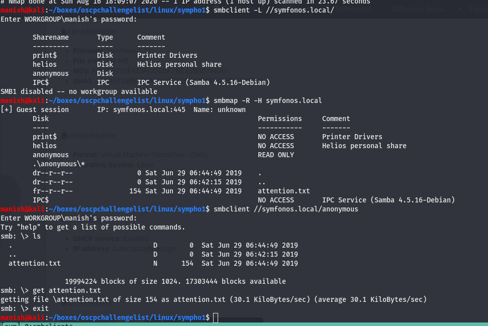


there users are using weak passwords lets try gather users and enumerate these shares again

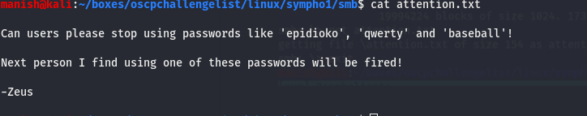


got into helios smb share using the given **qwerty**

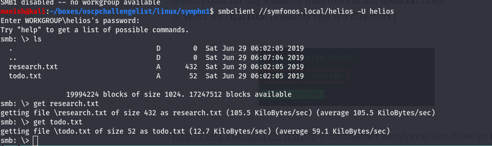


got a subdirectory

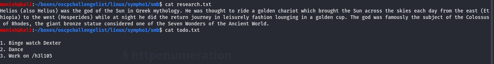


## httpenumeration

its a wordpress website lets enumerate it and see if we can get any usernames to crack

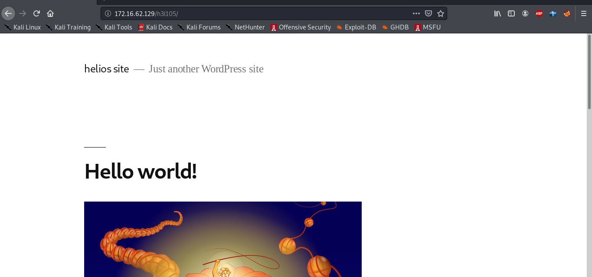


using wpscan

```
wpscan --api-token lOceTSFUZ16P4pCpRWPjZ7sZ9aMshs782DYqLYtNQA8 --url http://symfonos.local/h3l105/ --enumerate vp
```

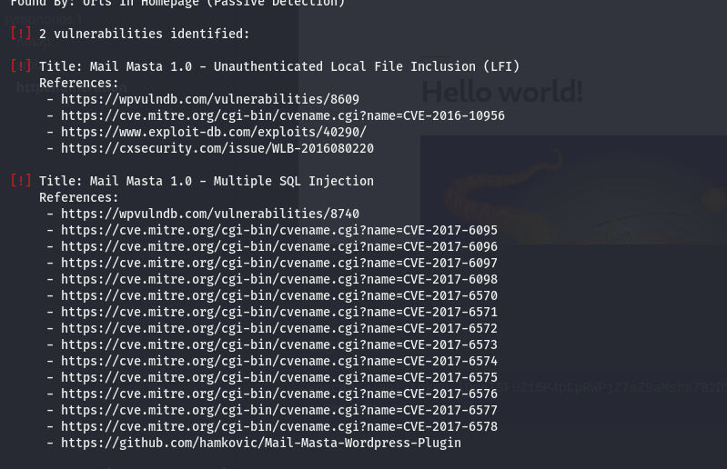


#### local file inclusion

https://www.exploit-db.com/exploits/40290

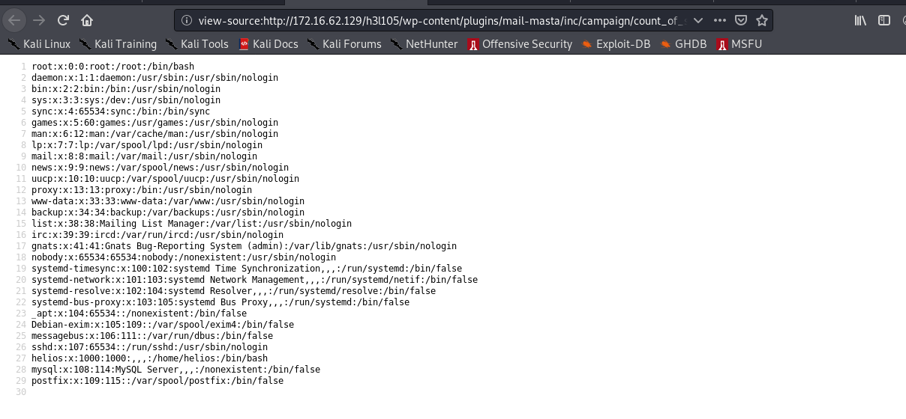


## LOG Poisoning

- we can use log to remote code execution
- we know there is no apache2 access log

- but there is a smtp server so we can check mail logs

```
/var/mail/helios
```

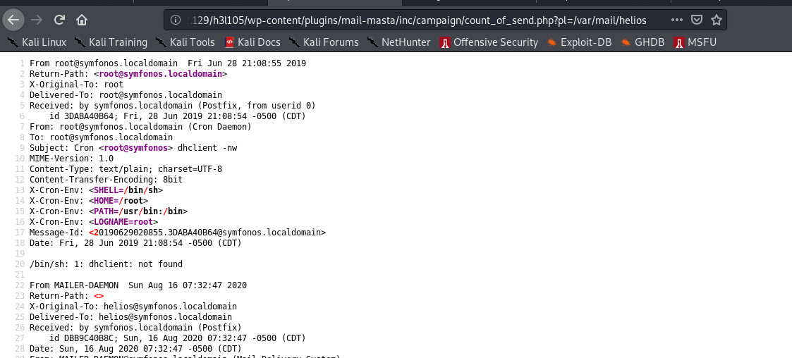


now we can use his email id for log poisoning

```
helios@symfonos.localdomain
```

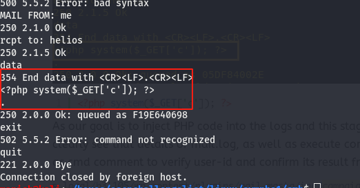


successfully got rce

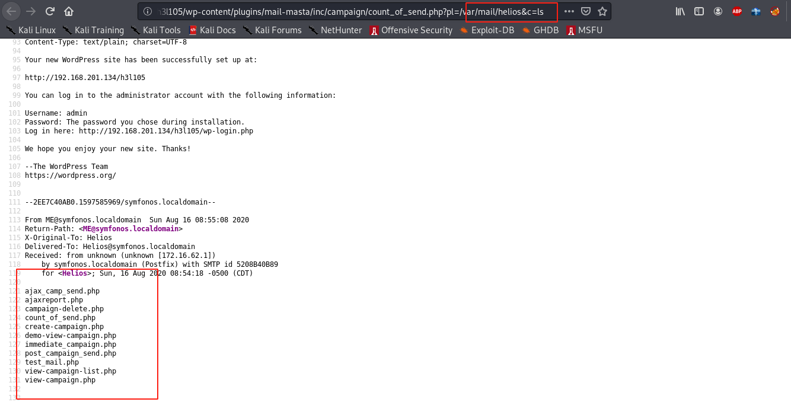


#### shell

- we know uploads directly is publicly available
- we can upload reverse shell in uploads directory
- execute it and get shell

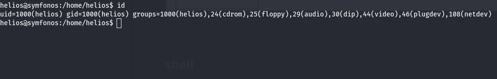


## post


find a file with sudo permission

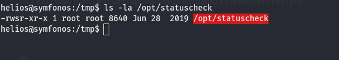


curl command is without absolute path we can exploit it by changing path variable

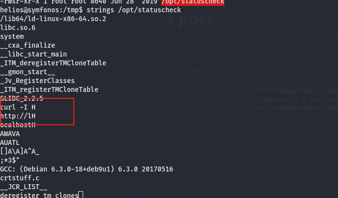


#### shell

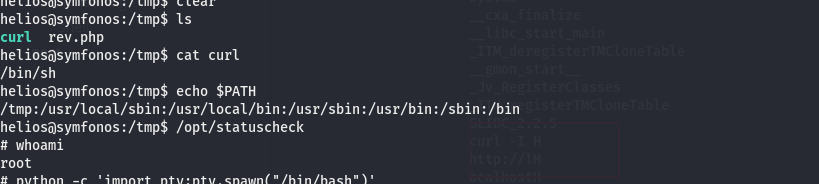