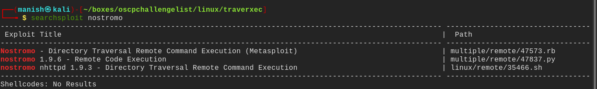
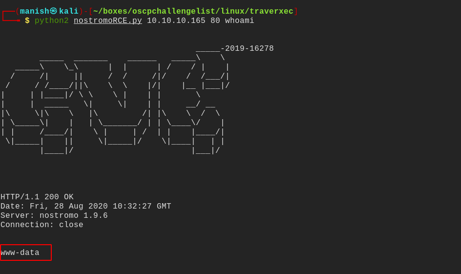
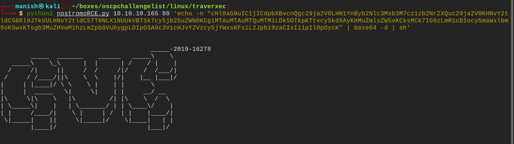
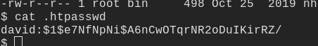
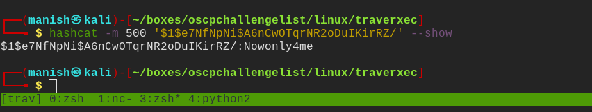
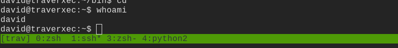
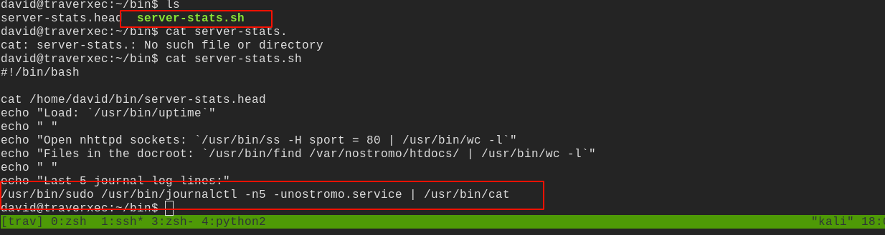
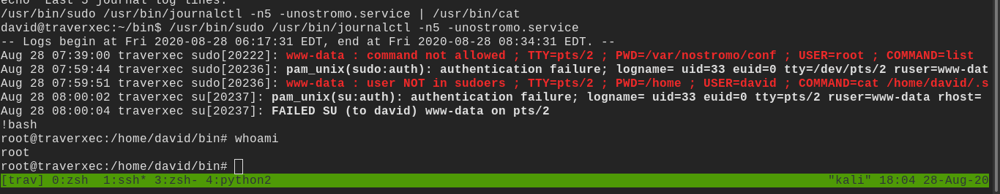

# traverxec

## nmap

PORT   STATE SERVICE VERSION
22/tcp open  ssh     OpenSSH 7.9p1 Debian 10+deb10u1 (protocol 2.0)
| ssh-hostkey: 
|   2048 aa:99:a8:16:68:cd:41:cc:f9:6c:84:01:c7:59:09:5c (RSA)
|   256 93:dd:1a:23:ee:d7:1f:08:6b:58:47:09:73:a3:88:cc (ECDSA)
|_  256 9d:d6:62:1e:7a:fb:8f:56:92:e6:37:f1:10:db:9b:ce (ED25519)
80/tcp open  http    nostromo 1.9.6
|_http-server-header: nostromo 1.9.6
|_http-title: TRAVERXEC
Service Info: OS: Linux; CPE: cpe:/o:linux:linux_kernel

## searchsploit

- we see a remote code execution of nostromo 1.9.6
- we can use it to get initial shell

#### command execution

#### base64

- using base64 encoded the command and then send it as arguement
- then decode it and passed it bash
- did this avoid any badcharacters problem terminating the request

- using linpeas found a interesting file
- it had a md5crypt encrypted password hash

#### hashcat

- it a md5crypt password hash
- cracked it using hashcat

#### credentials

~~username 		david~~

~~password		 Nowonly4me~~

- cannot use those creds anywhere

- found a directory inside david that is world readable 
- we found it configuration file
- there is ssh private key hidden in it
- we will crack it using john and get paraphrase

- got the shell as root

## post

- there bash script in which we can see something running as root

- sudo doestnot allow anything after pipe to run as root
- even if we remove /usr/bin/cat it will still work

