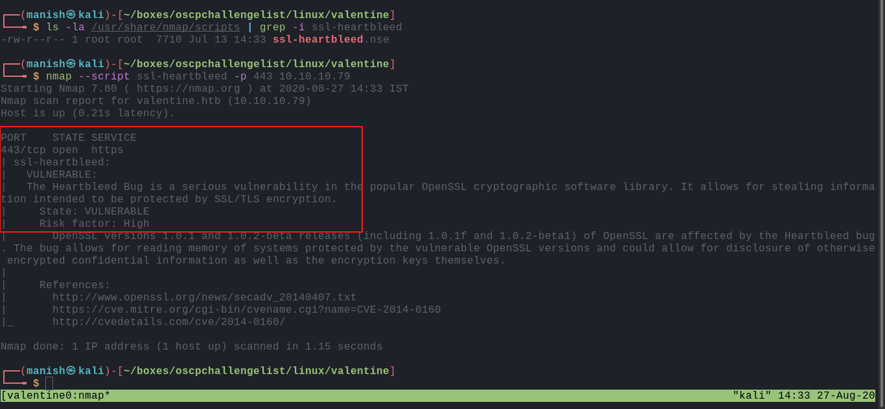
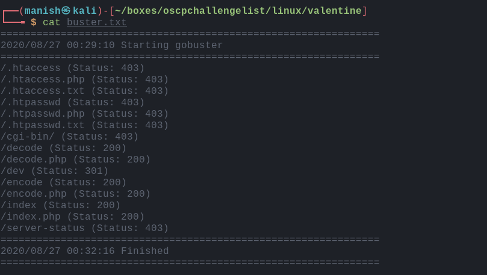
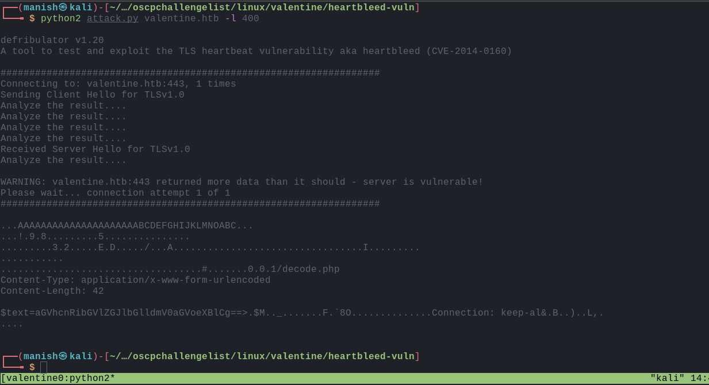
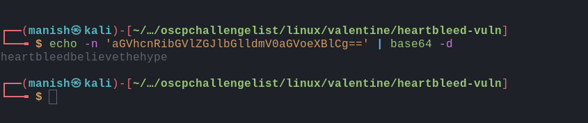
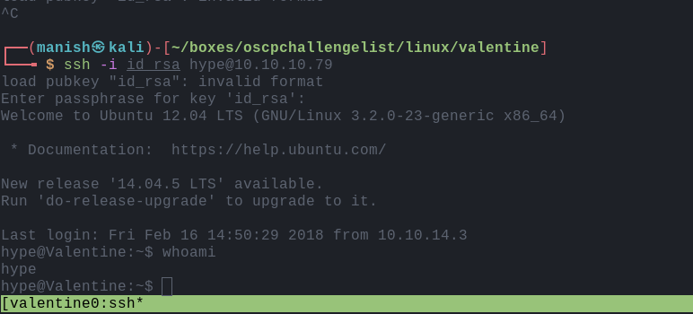
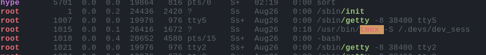
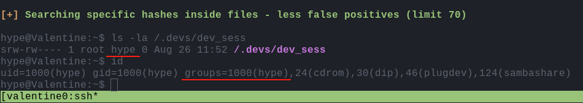
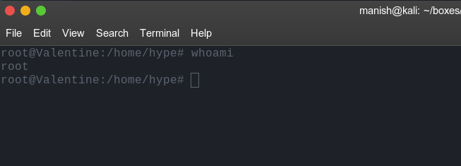
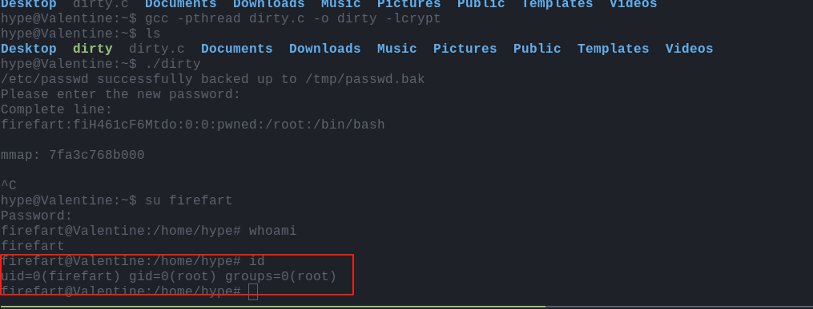

# valentine

## nmap

PORT    STATE SERVICE  VERSION
22/tcp  open  ssh      OpenSSH 5.9p1 Debian 5ubuntu1.10 (Ubuntu Linux; protocol 2.0)
| ssh-hostkey: 
|   1024 96:4c:51:42:3c:ba:22:49:20:4d:3e:ec:90:cc:fd:0e (DSA)
|   2048 46:bf:1f:cc:92:4f:1d:a0:42:b3:d2:16:a8:58:31:33 (RSA)
|_  256 e6:2b:25:19:cb:7e:54:cb:0a:b9:ac:16:98:c6:7d:a9 (ECDSA)
80/tcp  open  http     Apache httpd 2.2.22 ((Ubuntu))
|_http-server-header: Apache/2.2.22 (Ubuntu)
|_http-title: Site doesn't have a title (text/html).
443/tcp open  ssl/http Apache httpd 2.2.22 ((Ubuntu))
|_http-server-header: Apache/2.2.22 (Ubuntu)
|_http-title: Site doesn't have a title (text/html).
| ssl-cert: Subject: commonName=valentine.htb/organizationName=valentine.htb/stateOrProvinceName=FL/countryName=US
| Not valid before: 2018-02-06T00:45:25
|_Not valid after:  2019-02-06T00:45:25
|_ssl-date: 2020-08-26T18:55:09+00:00; +15s from scanner time.
Service Info: OS: Linux; CPE: cpe:/o:linux:linux_kernel

#### script engine

- its running ssl so we can check common vulnerabilities related to ssl through nmap scripting engine

  

- this is vulnerable to heartbleed attack
- we can lead information from servers memory with this attack to get any sensitive information

## httpenumeration

- in **dev** directory we have a ssh private key that is encrypted
- we need a paraphrase to decrypt it

## exploit

#### heartbleed

- got some base64 text that we can decode to get information

- looks like paraphrase for the  rsa encrypted paraphrase

#### shell

## post

- found a tmux server running as root
- we can check it
- also kernel version of linux is very old

- the tmux session is running as root
- and its in group hype and since we also members of group hype we can access it

after attaching the server we are root

- or we can perform dirtycow exploit

