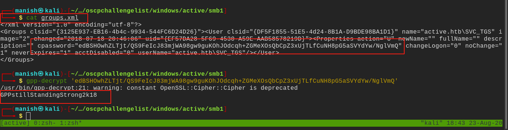
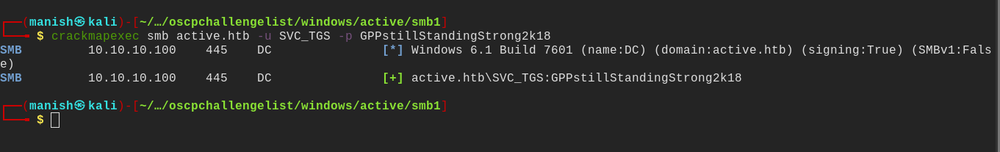
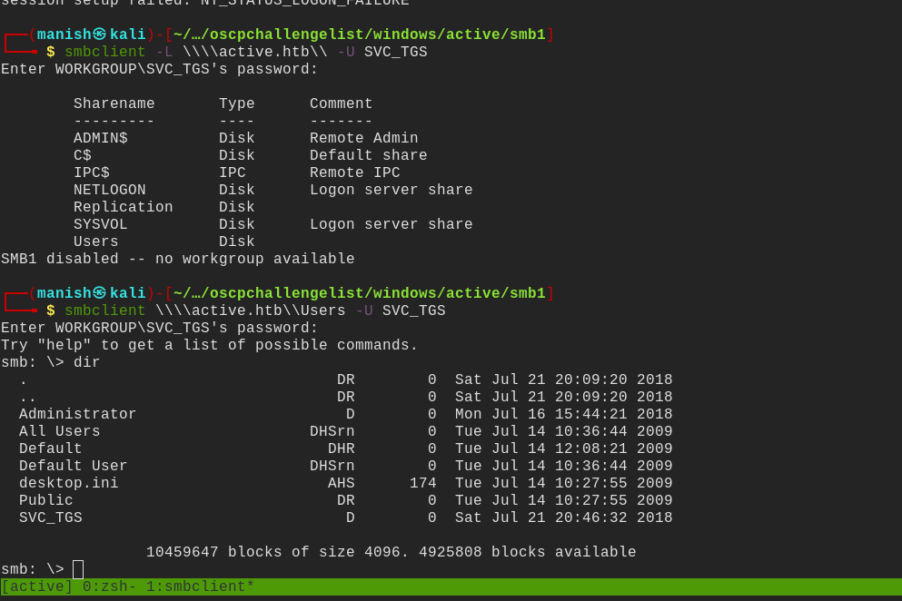
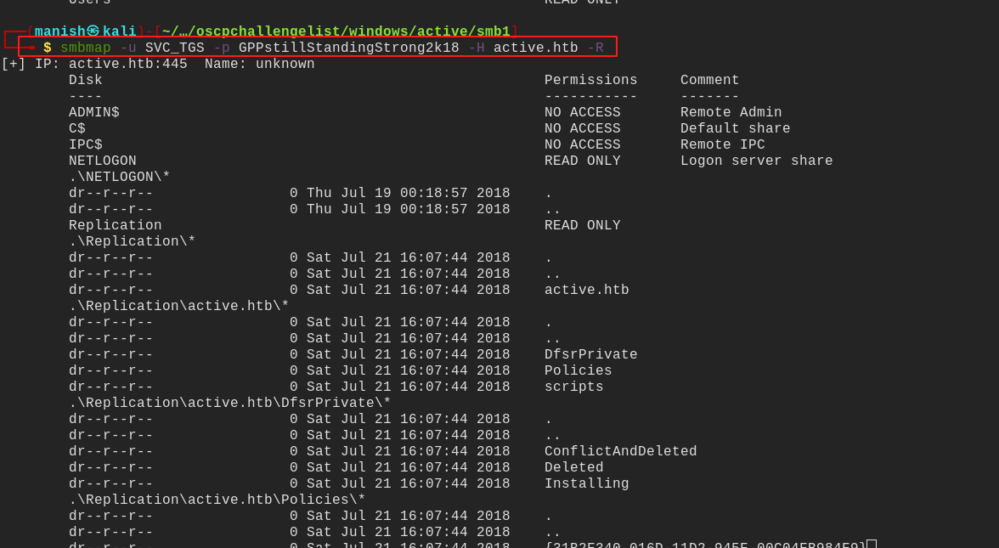
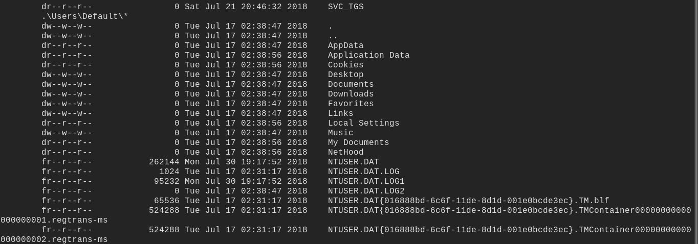
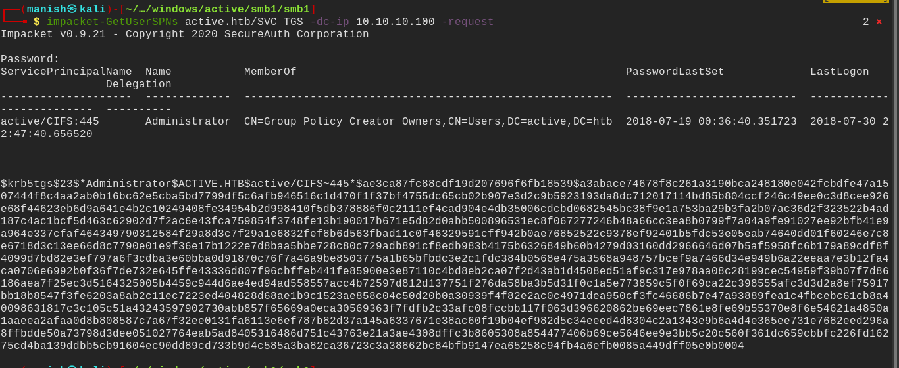
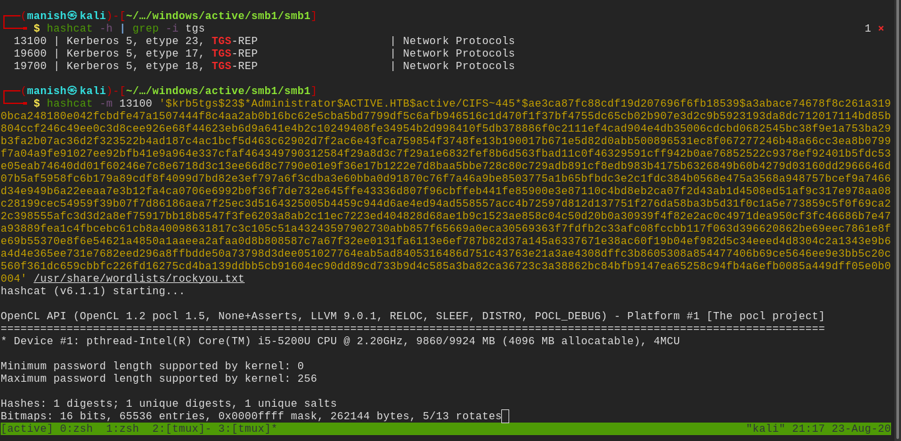
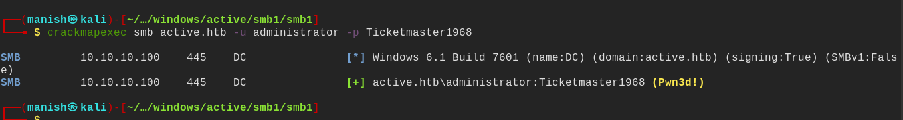
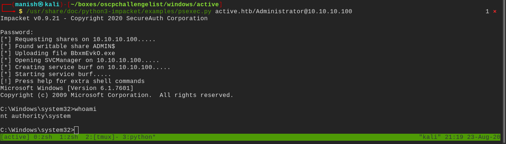

# active


## nmap


53/tcp    open  domain        Microsoft DNS 6.1.7601 (1DB15D39) (Windows Server 2008 R2 SP1)
| dns-nsid: 
|_  bind.version: Microsoft DNS 6.1.7601 (1DB15D39)
88/tcp    open  kerberos-sec  Microsoft Windows Kerberos (server time: 2020-08-23 12:31:25Z)
135/tcp   open  msrpc         Microsoft Windows RPC
139/tcp   open  netbios-ssn   Microsoft Windows netbios-ssn
389/tcp   open  ldap          Microsoft Windows Active Directory LDAP (Domain: active.htb, Site: Default-First-Site-Name)
445/tcp   open  microsoft-ds?
464/tcp   open  kpasswd5?
593/tcp   open  ncacn_http    Microsoft Windows RPC over HTTP 1.0
636/tcp   open  tcpwrapped
3268/tcp  open  ldap          Microsoft Windows Active Directory LDAP (Domain: active.htb, Site: Default-First-Site-Name)
3269/tcp  open  tcpwrapped
49152/tcp open  msrpc         Microsoft Windows RPC
49153/tcp open  msrpc         Microsoft Windows RPC
49154/tcp open  msrpc         Microsoft Windows RPC
49155/tcp open  msrpc         Microsoft Windows RPC
49157/tcp open  ncacn_http    Microsoft Windows RPC over HTTP 1.0
49158/tcp open  msrpc         Microsoft Windows RPC
Service Info: Host: DC; OS: Windows; CPE: cpe:/o:microsoft:windows_server_2008:r2:sp1, cpe:/o:microsoft:windows


## smb enumeration


#### smbclient

- found a file a group policy file
- this is due to a weakness in the way password updates are pushed to the domain
- and microsoft published the AES key so it  is easy to decrypt





#### credentials 

username															password

active.htb\SVC_TGS											GPPstillStandingStrong2k18


## crackmapexecGPPstillStandingStrong2k18

it shows us that we can access some share with this id and password




#### smbclient

got into new shares 




#### smbmap

```
smbmap -u SVC_TGS -p GPPstillStandingStrong2K18 -H active.htb -R
```

to recursively check for all the files




- found some interesting file in \USERS\DEFAULT share




## impacket


#### GetSPNUsers



- this gives tickers of users with service name principal set

- cracking the password using hashcat

  


#### hashcat




- verified with crackmapexec




#### psexec





