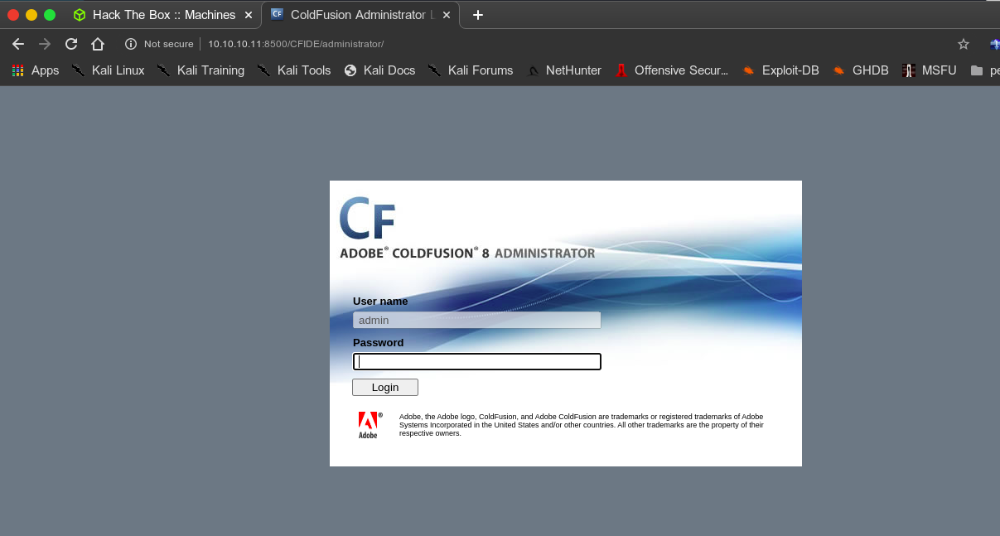
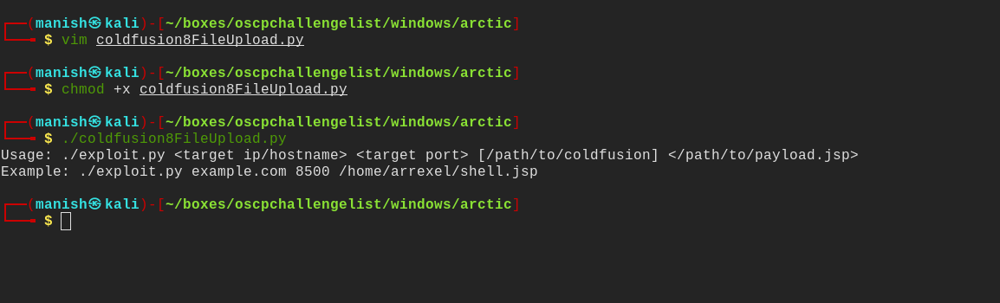
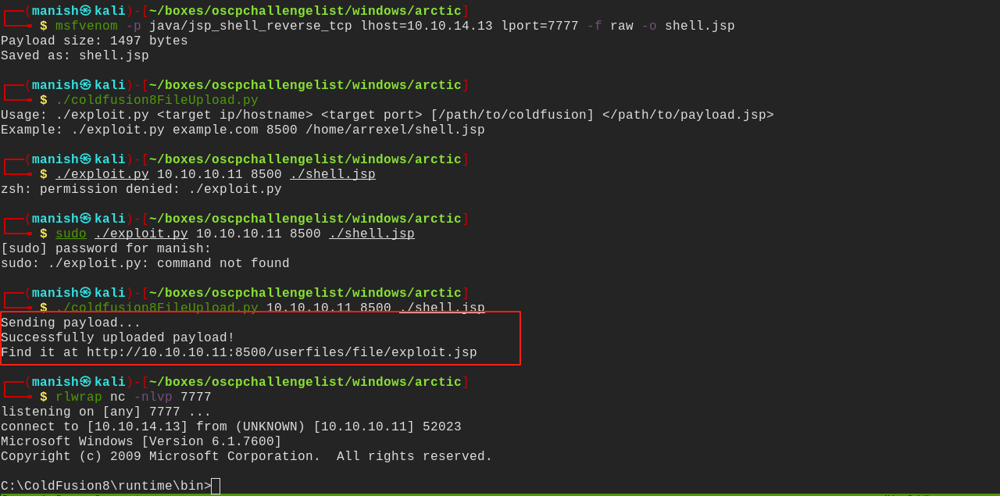
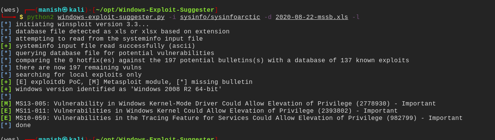
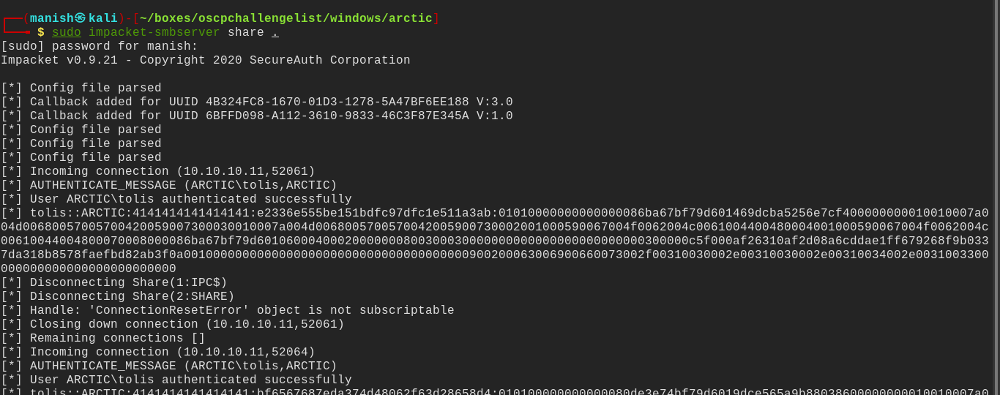
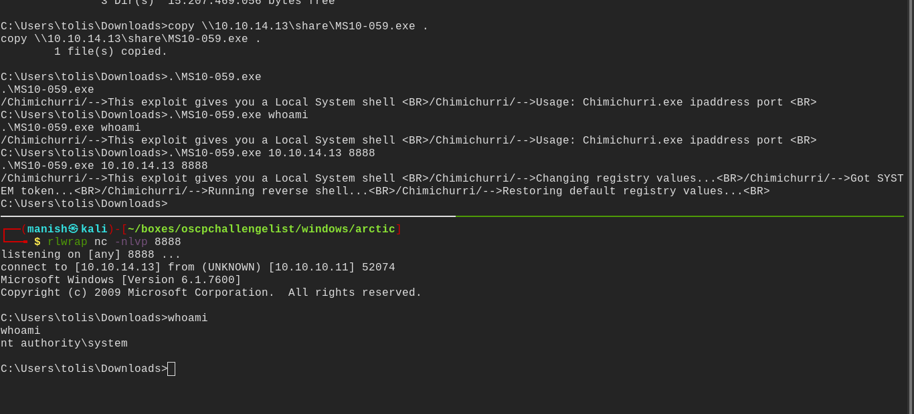

# arctic

## nmap

Host is up (0.13s latency).
Not shown: 65532 filtered ports
PORT      STATE SERVICE VERSION
135/tcp   open  msrpc   Microsoft Windows RPC
8500/tcp  open  fmtp?
49154/tcp open  msrpc   Microsoft Windows RPC
Service Info: OS: Windows; CPE: cpe:/o:microsoft:windows

- based on port enumeration only port 8500 seems interesting
- so w will explore it

## port 8500

- it is running adobe coldfusion 8
- seeing for some vulnerability in this software

## exploit

- after research we see it vulnerable to arbitrary file upload and found a script on gitlab

[cold fusion 8 arbitaryfile upload CVE-200902265](https://repo.theoremforge.com/pentesting/tools/blob/01a0616a6e09c9dbf42d731261309109443cc3e6/Uncategorized/exploit/windows/CVE-2009-2265_coldfusion.8.0.1/upload.py)

#### msfvenom

got the file uploaded and the reverse shell with msfvenom

## post

- using windows exploit suggestor
- to get all the vulnerabilities

#### smb

set up impackets-smbserver

- copy the exploit and run
- define the port and ip address and get the shell as NT AUTHORITY

