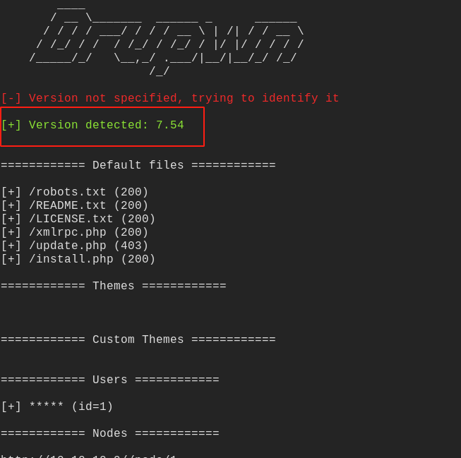
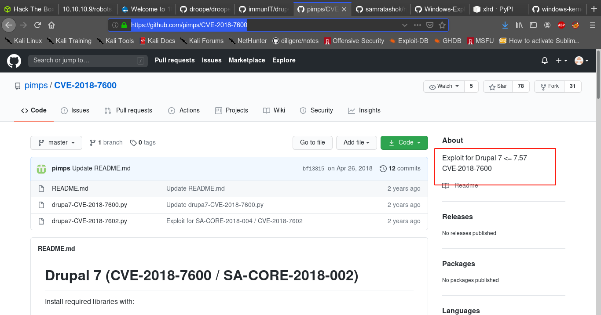
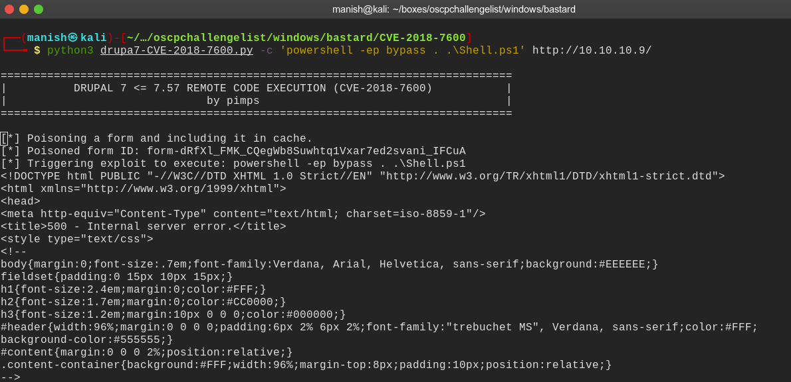
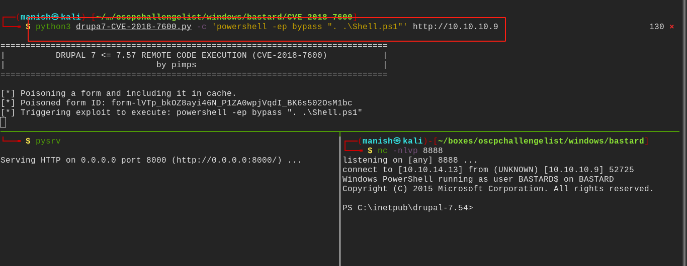
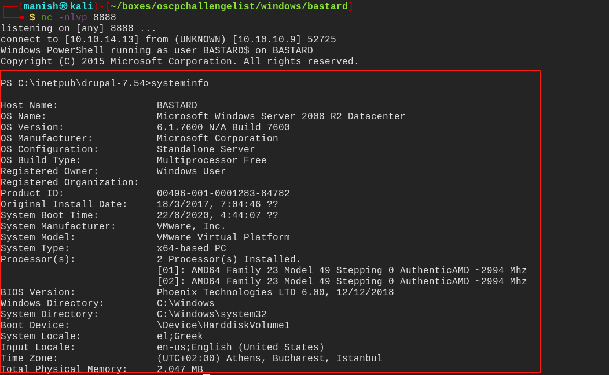
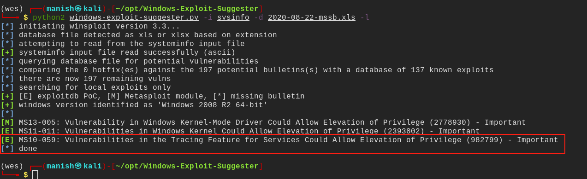
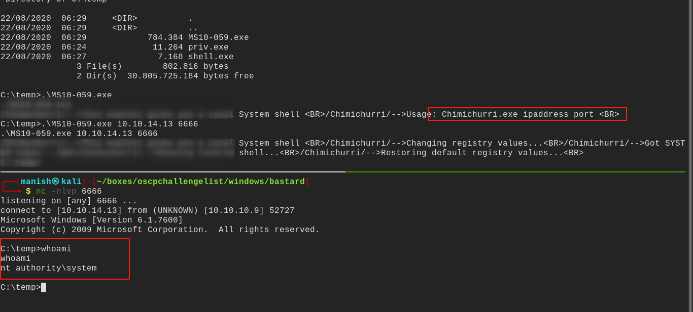

# bastard


## nmap


PORT      STATE SERVICE VERSION
80/tcp    open  http    Microsoft IIS httpd 7.5
|_http-generator: Drupal 7 (http://drupal.org)
| http-methods: 
|_  Potentially risky methods: TRACE
| http-robots.txt: 36 disallowed entries (15 shown)
| /includes/ /misc/ /modules/ /profiles/ /scripts/ 
| /themes/ /CHANGELOG.txt /cron.php /INSTALL.mysql.txt 
| /INSTALL.pgsql.txt /INSTALL.sqlite.txt /install.php /INSTALL.txt 
|_/LICENSE.txt /MAINTAINERS.txt
|_http-server-header: Microsoft-IIS/7.5
|_http-title: Welcome to 10.10.10.9 | 10.10.10.9
135/tcp   open  msrpc   Microsoft Windows RPC
49154/tcp open  msrpc   Microsoft Windows RPC
Service Info: OS: Windows; CPE: cpe:/o:microsoft:windows


## httpenumeration

we got lots of diallowed entries



with drupwn we see version is **7.54**


## vulnerability

searching online we got a exploit

[exploit](https://github.com/pimps/CVE-2018-7600) CVE-2018-7600




## shell

we got a shell 

1. first we create a server and put nishang reverse tcp powershell script
2. then we execute a certutil command to download the file
3. then we execute it with powershell #we can also edit and put invoke command inside it





got the shell




## post


now to exploit we will gather information about the system and pass it through windows exploit suggester




#### windows exploit suggester




```
after trying all three of them we got exploitation with MS10-059
```



got the root


