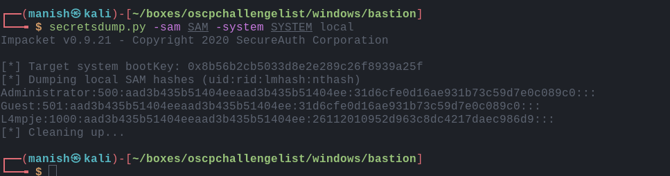

# bastion


### nmap

PORT    STATE SERVICE      VERSION
22/tcp  open  ssh          OpenSSH for_Windows_7.9 (protocol 2.0)
| ssh-hostkey: 
|   2048 3a:56:ae:75:3c:78:0e:c8:56:4d:cb:1c:22:bf:45:8a (RSA)
|   256 cc:2e:56:ab:19:97:d5:bb:03:fb:82:cd:63:da:68:01 (ECDSA)
|_  256 93:5f:5d:aa:ca:9f:53:e7:f2:82:e6:64:a8:a3:a0:18 (ED25519)
135/tcp open  msrpc        Microsoft Windows RPC
139/tcp open  netbios-ssn  Microsoft Windows netbios-ssn
445/tcp open  microsoft-ds Windows Server 2016 Standard 14393 microsoft-ds
Service Info: OSs: Windows, Windows Server 2008 R2 - 2012; CPE: cpe:/o:microsoft:windows

Host script results:
|_clock-skew: mean: -39m44s, deviation: 1h09m13s, median: 13s
| smb-os-discovery: 
|   OS: Windows Server 2016 Standard 14393 (Windows Server 2016 Standard 6.3)
|   Computer name: Bastion
|   NetBIOS computer name: BASTION\x00
|   Workgroup: WORKGROUP\x00
|_  System time: 2020-08-26T08:11:22+02:00
| smb-security-mode: 
|   account_used: guest
|   authentication_level: user
|   challenge_response: supported
|_  message_signing: disabled (dangerous, but default)
| smb2-security-mode: 
|   2.02: 
|_    Message signing enabled but not required
| smb2-time: 
|   date: 2020-08-26T06:11:18
|_  start_date: 2020-08-25T10:49:29


### smbenumeration

```
crackmapexec 10.10.10.134 -u ' ' -p ' ' --shares
```


- we got backups folder that we have read access to


#### mount smb

- backups is a big folder
- so we zip packages for Linux andwill mount it and analyze its content to anything useful


- after mounting smb we get **vhd** file 
- its virtual hard disk we cannot download the file so we will try to mount it
- i used smbshare to divert traffic to windows vmware . 
- so that i can easily mount it and extract hashes


## impacket

- once mounted we need SAM and SYSTEM to dump hashes
- then we can use secretsdump




got the hashes we can now login in with evil-winrm or psexec


#### pass the hash attack


- we can see we can write to backups directory so we can use psexec to get a shell
- we dont get any shell
- but we have ssh on the machine we can sign in with it using the credentials
- we also need to crack NTLM password hash of user L4mpje


## post

- we find one interesting application to take a look at


- after looking online we found a utility called as mRemoteNG decrypt 
- after searching we found that it stores password in %appdata%\roamining\nRemoteNG\confCONS.xml
- we get base64 encrypted password

- used the tool and got the password

#### root

