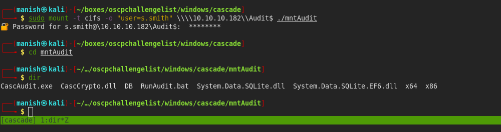

# cascade


## nmap


PORT      STATE SERVICE       VERSION
53/tcp    open  domain        Microsoft DNS 6.1.7601 (1DB15D39) (Windows Server 2008 R2 SP1)
| dns-nsid: 
|_  bind.version: Microsoft DNS 6.1.7601 (1DB15D39)
88/tcp    open  kerberos-sec  Microsoft Windows Kerberos (server time: 2020-09-03 09:00:43Z)
135/tcp   open  msrpc         Microsoft Windows RPC
139/tcp   open  netbios-ssn   Microsoft Windows netbios-ssn
389/tcp   open  ldap          Microsoft Windows Active Directory LDAP (Domain: cascade.local, Site: Default-First-Site-Name)
445/tcp   open  microsoft-ds?
636/tcp   open  tcpwrapped
3268/tcp  open  ldap          Microsoft Windows Active Directory LDAP (Domain: cascade.local, Site: Default-First-Site-Name)
3269/tcp  open  tcpwrapped
49154/tcp open  msrpc         Microsoft Windows RPC
49155/tcp open  msrpc         Microsoft Windows RPC
49157/tcp open  ncacn_http    Microsoft Windows RPC over HTTP 1.0
49158/tcp open  msrpc         Microsoft Windows RPC
49165/tcp open  msrpc         Microsoft Windows RPC


- looks like a domain controller with port 53 88 and 389 open


## domain enumeration

#### rpcclient


#### ldapsearch

- ldapsearch to search for something interesting

```bash
ldapsearch -x -b "dc=cascade,dc=local" -h 10.10.10.182 '(objectclass=person)'
```


- we filter for unique things

```bash
cat ldapquery| awk '{print $1}' | sort | uniq -c | sort -nr | grep ":"
```


- we have cascade legacy password lets see what is it

- we got a base64 encoded password and a sAMAccountName


- we cannot  use remote session but we can get into shares 


## shares

```bash
sudo mount -t cifs - "user=r.thompson" \\\\10.10.10.182\\Data ./mntdata
```

- mounting share to a directory mntdata


#### note

- got a mail saying they created a temporary administrator for network migration
- and account will be deleted in 2018


- there AD recycle bin logs show a deleted account TempAdmin


#### vnc.reg

- found a encrypted hex password so we need to decrypt it as well
- here is a github link that tells us how to decrypt vnc registry password


- got the password


#### credentials

s.smith					sT333ve2

#### shell

- got a usershell using these credentials


## post

- we can access a new share AUDIT$
- we are member of a group called audit share 


- lots of things are in this share , mount it to see more information


- this looks like windows program lets use windows to analyze it
- going to create a smbshare and access it from there



- dumping the database we know its the user ArkSvc and one encrypted password


#### dnSpy

- using dnspy we put a breakpoint where it calls for the decrypt string and debugged it to get password

- we got a password

  ​			"w3lc0meFr31nd"


#### credentials

ArkSvc									w3lc0meFr31nd

#### shell


#### AD recycle bin


- we are part of AD recycle bin group
- this means we can check for deleted accounts and users in the domain


```powershell
Get-ADObject -ldapFilter:"(msDS-LastKnownRDN=*)" -IncludeDeletedObjects -property *
```

- we found tempadmin there 
- it also has cascade legacy password that is base64 encoded


- we got password for tempadmin
- we know its the password of normal administrator user so we can try this password with normal user


#### root

- we are root


- we can forge a golden ticket with krbtgt hash and access any resources

