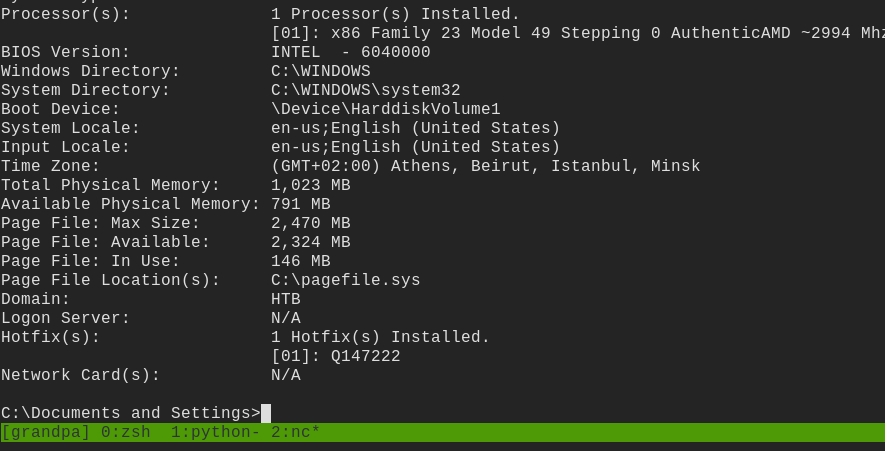
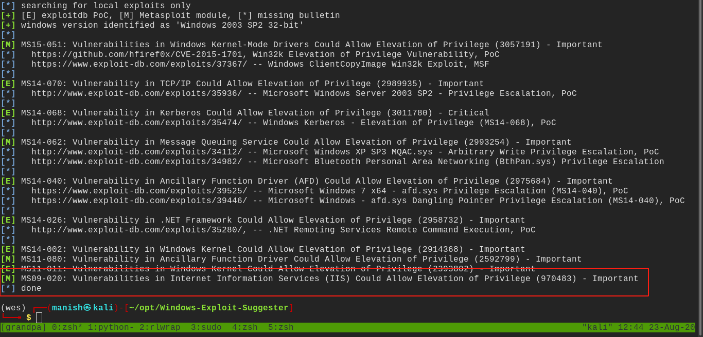

# grandpa

## nmap

80/tcp open  http    Microsoft IIS httpd 6.0
| http-methods: 
|_  Potentially risky methods: TRACE COPY PROPFIND SEARCH LOCK UNLOCK DELETE PUT MOVE MKCOL PROPPATCH
|_http-server-header: Microsoft-IIS/6.0
|_http-title: Under Construction
| http-webdav-scan: 
|   Public Options: OPTIONS, TRACE, GET, HEAD, DELETE, PUT, POST, COPY, MOVE, MKCOL, PROPFIND, PROPPATCH, LOCK, UNLOCK, SEARCH
|   WebDAV type: Unknown
|   Server Type: Microsoft-IIS/6.0
|   Allowed Methods: OPTIONS, TRACE, GET, HEAD, COPY, PROPFIND, SEARCH, LOCK, UNLOCK
|_  Server Date: Sun, 23 Aug 2020 06:01:22 GMT

## davtest and cadaver

web dav is not accessible probably they are password protected

## vulnerability

- using a known vulnerability in IIS 6.0 
- CVE-2017-7269

## shell

## post

rundll32.exe evil.dll Control_RunDLL

using windows exploit suggester

rundll32.exe evil.dll Control_RunDLL

- found a manual exploit
- used it but its giving temporary shells

