# hiest


## nmap


PORT    STATE SERVICE       VERSION
80/tcp  open  http          Microsoft IIS httpd 10.0
| http-cookie-flags: 
|   /: 
|     PHPSESSID: 
|_      httponly flag not set
| http-methods: 
|_  Potentially risky methods: TRACE
|_http-server-header: Microsoft-IIS/10.0
| http-title: Support Login Page
|_Requested resource was login.php
135/tcp open  msrpc         Microsoft Windows RPC
445/tcp open  microsoft-ds?
Service Info: OS: Windows; CPE: cpe:/o:microsoft:windows

Host script results:
|_clock-skew: 14s
| smb2-security-mode: 
|   2.02: 
|_    Message signing enabled but not required
| smb2-time: 
|   datPORT    STATE SERVICE       VERSION
80/tcp  open  http          Microsoft IIS httpd 10.0
| http-cookie-flags: 
|   /: 
|     PHPSESSID: 
|_      httponly flag not set
| http-methods: 
|_  Potentially risky methods: TRACE
|_http-server-header: Microsoft-IIS/10.0
| http-title: Support Login Page
|_Requested resource was login.php
135/tcp open  msrpc         Microsoft Windows RPC
445/tcp open  microsoft-ds?
Service Info: OS: Windows; CPE: cpe:/o:microsoft:windows

Host script results:
|_clock-skew: 14s
| smb2-security-mode: 
|   2.02: 
|_    Message signing enabled but not required
| smb2-time: 
|   date: 2020-08-25T14:20:31
|_  start_date: N1 md5 cisco password/Ae: 2020-08-25T14:20:31
|_  start_date: N/A


## httpenumeration

- from the webpage we logged in as guest 
- and downloaded a config.txt file
- enumerating the file we get **2 password of cisco 7**  and **1 md5 cisco password** 
- using a ciscot7 tool we cracked the password of cisco 

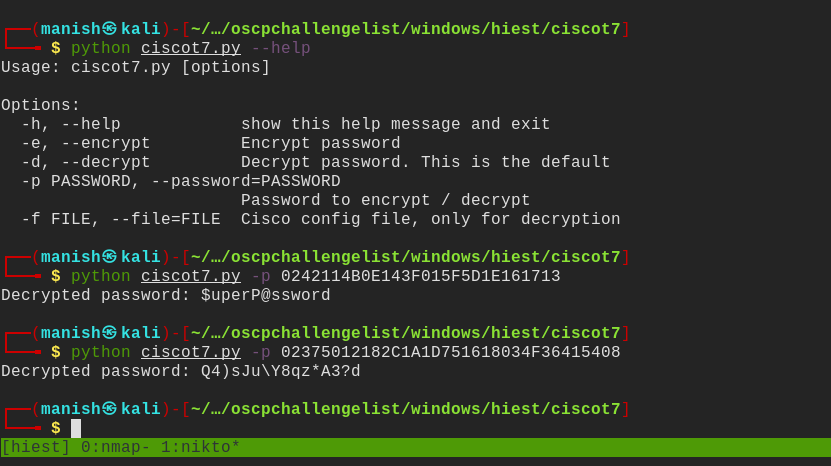


#### passwords

- this is what password file looks like

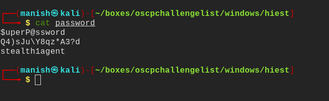


## crackmapexec

- we got one valid hit 
- but we have not access to smb

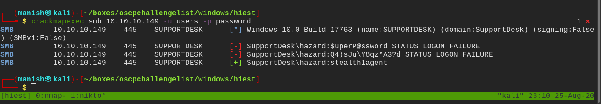


- we can use this credentials to get into domain and enumerate other usersimage-20200825231057276


### rpcclient

- using rpcclient we can enumerate other users but we need sid
- we already know one username and password we can get his sid and bruteforce sids

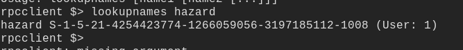

- this hazards sid
- now we can brute force other users sid by changing last 4 digit we can verify it by typing 500 which is default to administrator

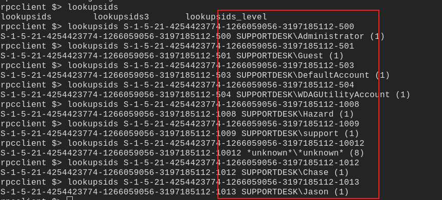


### impacket lookupsids

- we got so many new users we can also use impacket tools for this

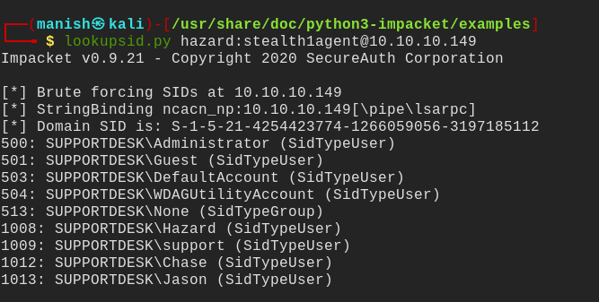

- we can add this to our usernames and see if anything matches using crackmapexec


### shell

- using crackmapexec we got a shell because we use ps-session to login to the desktop

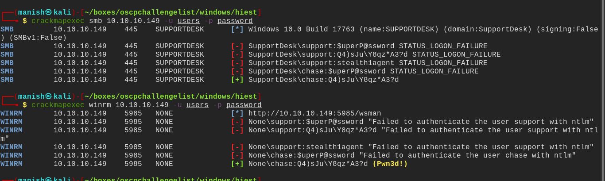


**credentials**

chase		:		Q4)sJu\Y8qz*A3?d

- we got the shell

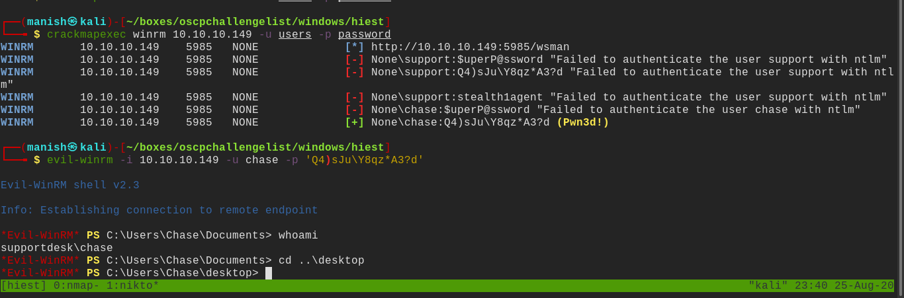


## post

- we see mozilla firefox is installed
- we can try to dump the credentials from its memory

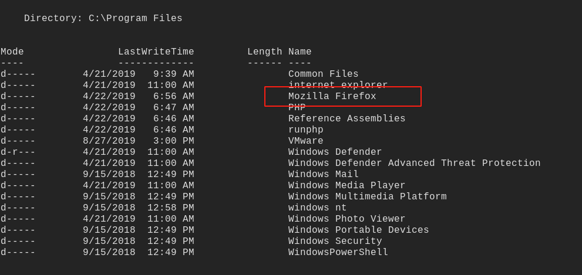


#### powershell

- we can dump firefox from main memory
- and check for any passwords 
- we will use sysinternals tool **procdump64**

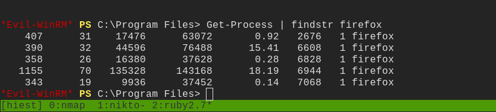


#### sysinternals

- we will use procdump to dump a process from memory

```
procdump -ma pid firefox.dmp
```

- this will dump firefox from main memory to hard drive and we can analyse it
- then we will use strings to get information about anything realted to password

neonlogin_username=admin%40aadmin&login_password=admin&login=

neonneon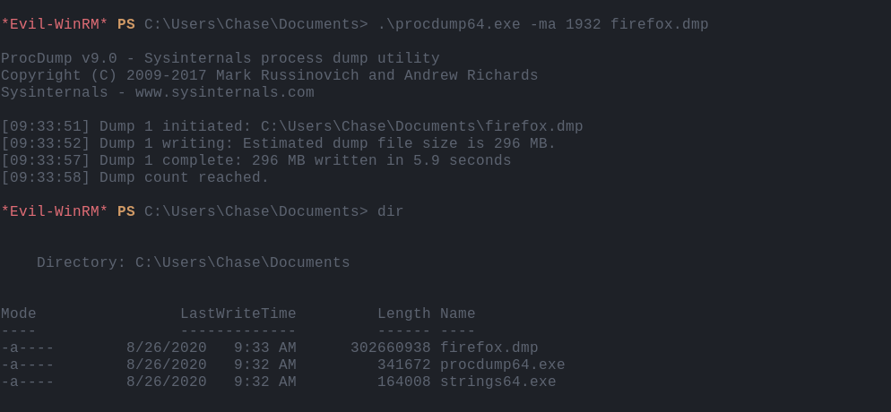

- we can use strings to get grep for password


#### Invoke-Mimikittenz

- this is a useful tool for search for a something in memory with creating dump
- it uses windows api ReadProcessMemory()
- we can use it and give a custom regex to search for our strings

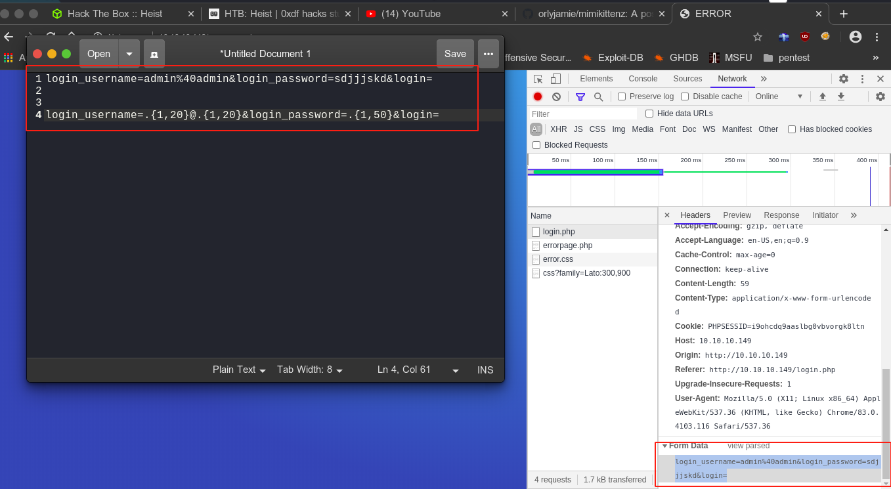

- we use regex to match for the login pattern
- and we find a match


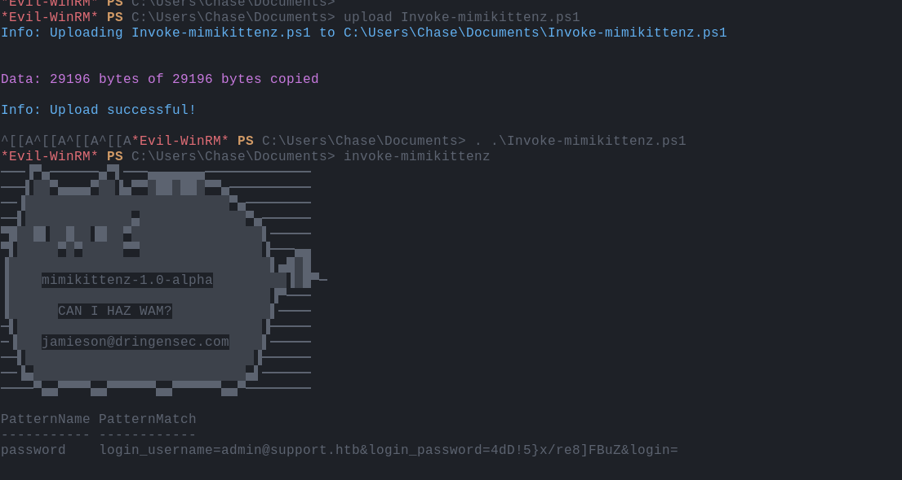

#### credentials

username = admin

password = 4dD!5}x/re8]FBuZ


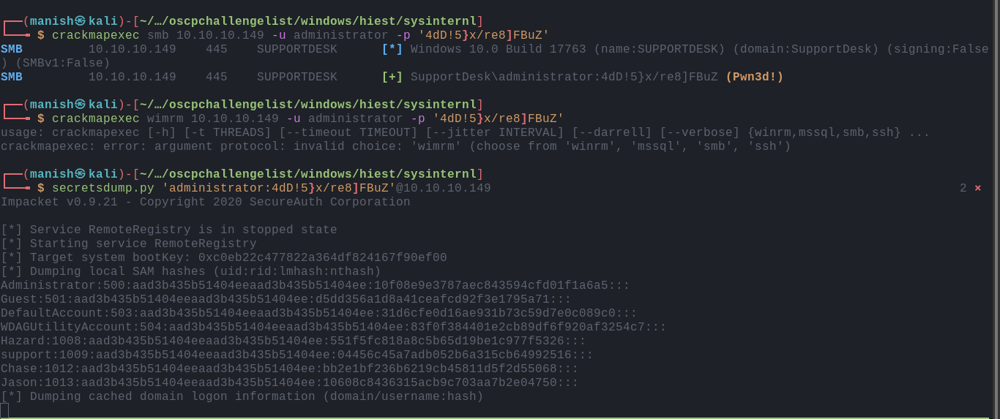