# nest


## nmap


PORT    STATE SERVICE
445/tcp open  microsoft-ds

Host script results:
|_clock-skew: 36s
| smb2-security-mode: 
|   2.02: 
|_    Message signing enabled but not required
| smb2-time: 
|   date: 2020-09-19T03:48:51
|_  start_date: 2020-09-19T03:46:07


## smb


#### crackmapexec

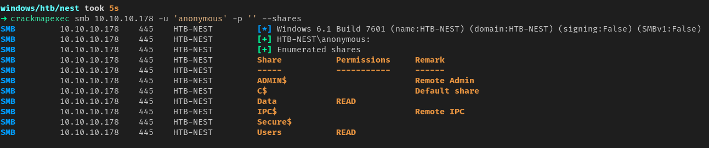

1. Name of the machine is HTB-NEST
2. anonymous login is allowed
3. two readable shares are present **Data** and **Users**


1. Got 2 files
2. one of them contains credentials for TempUser

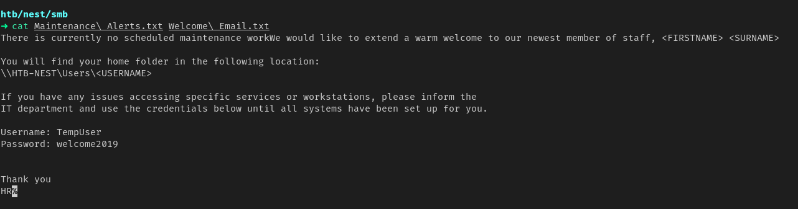


#### credentials

```
TempUser
Welcome2019
```


## mount

- mounting all the shares

```
sudo mount -t cifs -o "user=TempUser" \\\\10.10.10.178\\Data mntDATA
sudo mount -t cifs -o "user=TempUser" \\\\10.10.10.178\\Secure$ mntSecure
sudo mount -t cifs -o "user=TempUser" \\\\10.10.10.178\\Users mntUsers
```


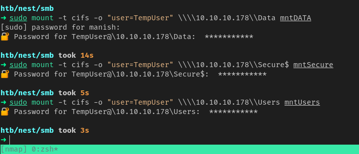


1. found some interestinf directories

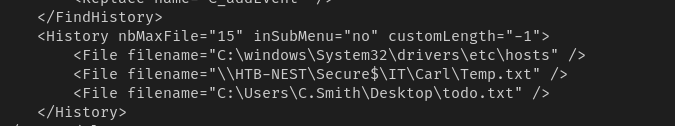


## dotnet

- found a dotnet project
- RUScanner and it contains a config file that has password but it is encrypted
- we can decrypt password with this project

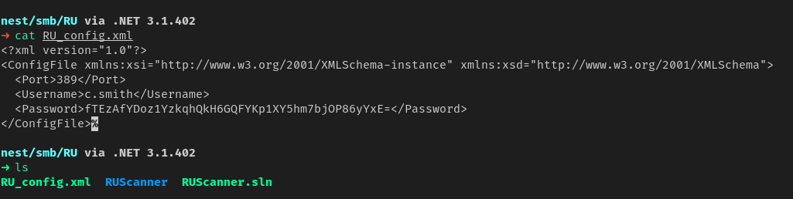

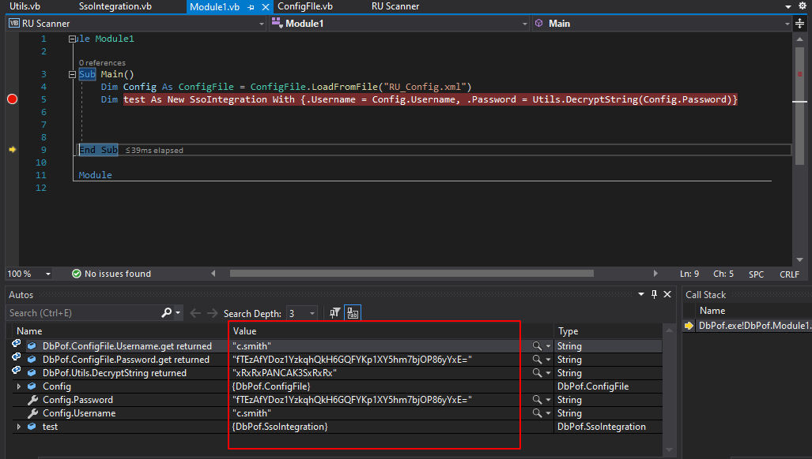


#### credentials

- got credential of c.smith

```
c.smith
xRxRxPANCAK3SxRxRx
```


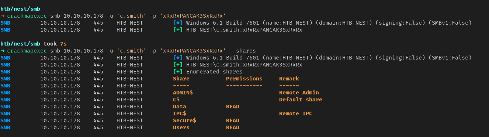


## Priv Esc

- in c.smith directory we find a port opened at 4386 
- nmap to see if its open

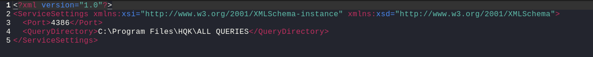

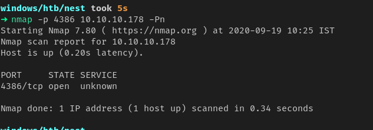

- we got some service running on port 4386


#### alernate data stream

- debug mode password was saved in alternate data stream

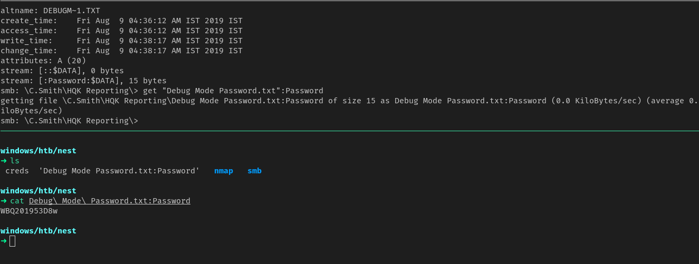


#### HQK Reporting Service

- by enabling debug mode we can read files
- found  ldap config file with encrypted administrative credentials
- we will use dnSpy to reverse engineer this application and give it Ldap.conf

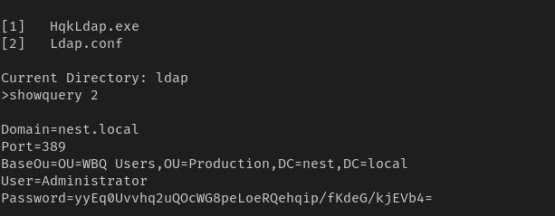


#### dnSpy

1.  using dnSpy we edited original binary to print password

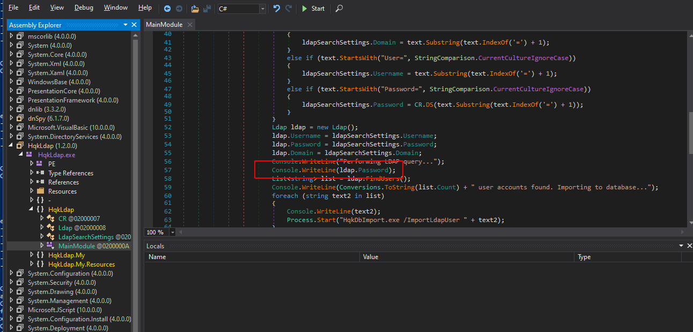


2. got thecredential

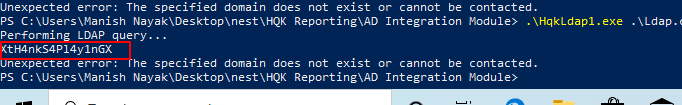


#### credentials

```
Administrator
XtH4nkS4Pl4y1nGX
```


3. got root

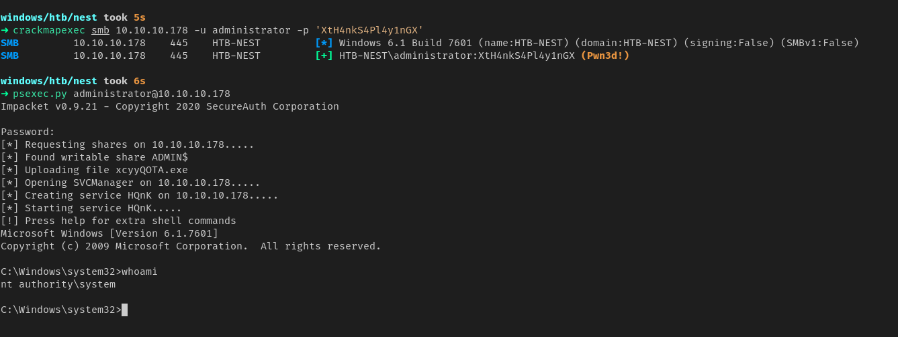