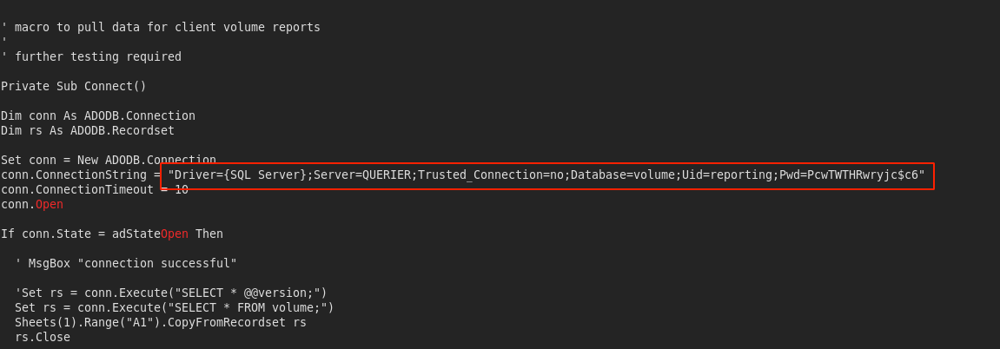
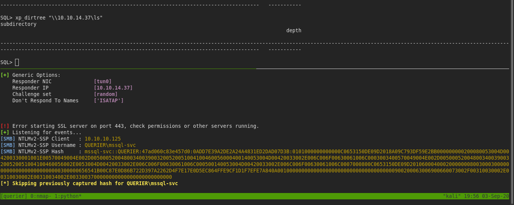
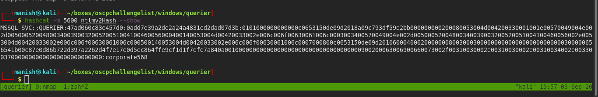
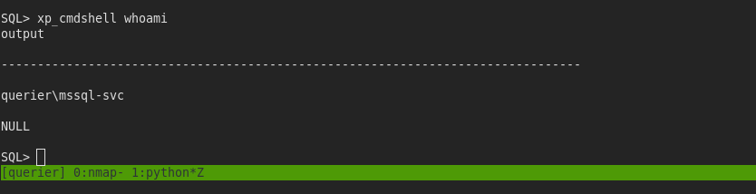
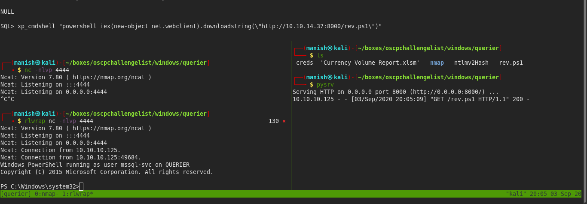
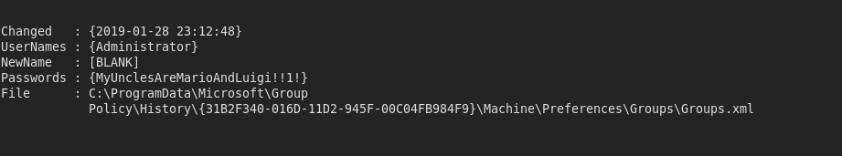
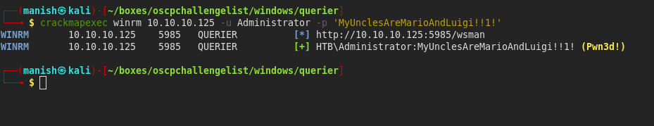
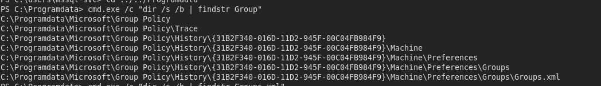
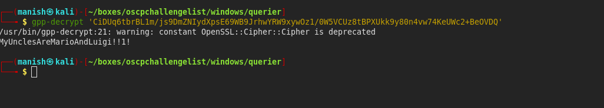

# querier

## nmap

Not shown: 996 closed ports                                                                                                                                              
PORT     STATE SERVICE       VERSION                                                                                                                                     
135/tcp  open  msrpc         Microsoft Windows RPC                                                                                                                       
139/tcp  open  netbios-ssn   Microsoft Windows netbios-ssn                                                                                                               
445/tcp  oNot shown: 996 closed ports                                                                                                                                              
PORT     STATE SERVICE       VERSION                                                                                                                                     
135/tcp  open  msrpc         Microsoft Windows RPC                                                                                                                       
139/tcp  open  netbios-ssn   Microsoft Windows netbios-ssn                                                                                                               
445/tcp  open  microsoft-ds?
1433/tcp open  ms-sql-s      Microsoft SQL Server 2017 14.00.1000.00; RTM
| ms-sql-ntlm-info: 
|   Target_Name: HTB
|   NetBIOS_Domain_Name: HTB
|   NetBIOS_Computer_Name: QUERIER
|   DNS_Domain_Name: HTB.LOCAL
|   DNS_Computer_Name: QUERIER.HTB.LOCAL
|   DNS_Tree_Name: HTB.LOCAL
|_  Product_Version: 10.0.17763
| ssl-cert: Subject: commonName=SSL_Self_Signed_Fallback
| Not valid before: 2020-09-03T11:38:01
|_Not valid after:  2050-09-03T11:38:01
|_ssl-date: 2020-09-03T12:58:00+00:00; -59m39s from scanner time.pen  microsoft-ds?
1433/tcp open  ms-sql-s      Microsoft SQL Server 2017 14.00.1000.00; RTM
| ms-sql-ntlm-info: 
|   Target_Name: HTB
|   NetBIOS_Domain_Name: HTB
|   NetBIOS_Computer_Name: QUERIER
|   DNS_Domain_Name: HTB.LOCAL
|   DNS_Computer_Name: QUERIER.HTB.LOCAL
|   DNS_Tree_Name: HTB.LOCAL
|_  Product_Version: 10.0.17763
| ssl-cert: Subject: commonName=SSL_Self_Signed_Fallback
| Not valid before: 2020-09-03T11:38:01
|_Not valid after:  2050-09-03T11:38:01
|_ssl-date: 2020-09-03T12:58:00+00:00; -59m39s from scanner time.

no webserver

## smb enumeration

- we got a file from smb share which contains user name and password for Microsoft SQL Server

#### credentials

username		reporting

password		PcwTWTHRwryjc$c6

#### impacket

- we will mssqlclient.py to connect to Microsoft Windows Mysql server
- then we will open responder to capture hash of service account

#### hashcat

- cracked the password using hashcat

#### credentials

username				MSSQL-SVC

password				corporate568

- we got code execution
- we can get a reverse shell as service account

## shell

- shell

## post

- we got group policy with administrator password

- Groups.xml

- gpp-decrypt

- we can get the password manually