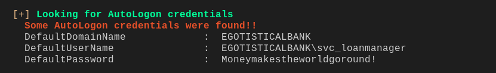

# sauna

## nmap

PORT     STATE SERVICE       VERSION
53/tcp   open  domain?
| fingerprint-strings: 
|   DNSVersionBindReqTCP: 
|     version
|_    bind
80/tcp   open  http          Microsoft IIS httpd 10.0
| http-methods: 
|_  Potentially risky methods: TRACE
|_http-server-header: Microsoft-IIS/10.0
|_http-title: Egotistical Bank :: Home
88/tcp   open  kerberos-sec  Microsoft Windows Kerberos (server time: 2020-08-26 18:00:56Z)
135/tcp  open  msrpc         Microsoft Windows RPC
139/tcp  open  netbios-ssn   Microsoft Windows netbios-ssn
389/tcp  open  ldap          Microsoft Windows Active Directory LDAP (Domain: EGOTISTICAL-BANK.LOCAL0., Site: Default-First-Site-Name)
445/tcp  open  microsoft-ds?
464/tcp  open  kpasswd5?
593/tcp  open  ncacn_http    Microsoft Windows RPC over HTTP 1.0
636/tcp  open  tcpwrapped
3268/tcp open  ldap          Microsoft Windows Active Directory LDAP (Domain: EGOTISTICAL-BANK.LOCAL0., Site: Default-First-Site-Name)
3269/tcp open  tcpwrapped
1 service unrecognized despite returning data. If you know the service/version, please submit the following fingerprint at https://nmap.org/cgi-bin/submit.cgi?new-service :
SF-Port53-TCP:V=7.80%I=7%D=8/26%Time=5F4640DE%P=x86_64-pc-linux-gnu%r(DNSV
SF:ersionBindReqTCP,20,"\0\x1e\0\x06\x81\x04\0\x01\0\0\0\0\0\0\x07version\
SF:x04bind\0\0\x10\0\x03");
Service Info: Host: SAUNA; OS: Windows; CPE: cpe:/o:microsoft:windows

## httpenum

- found few usernames to enum

## impacket

#### GetNPUsers.py

- this is called as as rep roast 
- this occurs because pre authentication is disabled

- we got a hash for one of the user lets crack it using hashcat

#### hashcat

- got the password

#### crackmap exec

- is edge does not grant the ability to perform an attack. However, in conjunction with DS-Replication-Get-Changes, a principal may perform a DCSync attack.using crackmapexec to see if we have any privileges

- it says pwn3d!
- we can get a shell using windows remote management

## post

#### winPEAS

- got new credentials
- for svc_loanmanager

#### credentials

username 		svc_loanmanager

password		  Moneymakestheworldgoround!

#### bloodhound 

- we will use bloodhound powershell  module (sharphound) to collect all the information about domain
- we will get a zip file which we will download 
- and analyze it in bloodhound

- from svc_manager we have dc sync rights
- we need 2 permissions that we have in conjuction

## impacket

#### secretsdump.py

- we have dcsync right 
- we can dump ntds.dit file 

- crackmapexec now we can pass the hash of administrator

#### root

