# Fox


## nmap

PORT    STATE SERVICE     REASON  VERSION
80/tcp  open  http        syn-ack Apache httpd 2.4.29
139/tcp open  netbios-ssn syn-ack Samba smbd 3.X - 4.X (workgroup: YEAROFTHEFOX)
445/tcp open  netbios-ssn syn-ack Samba smbd 3.X - 4.X (workgroup: YEAROFTHEFOX)
Service Info: Hosts: year-of-the-fox.lan, YEAR-OF-THE-FOX


## smb


#### smb enumeration

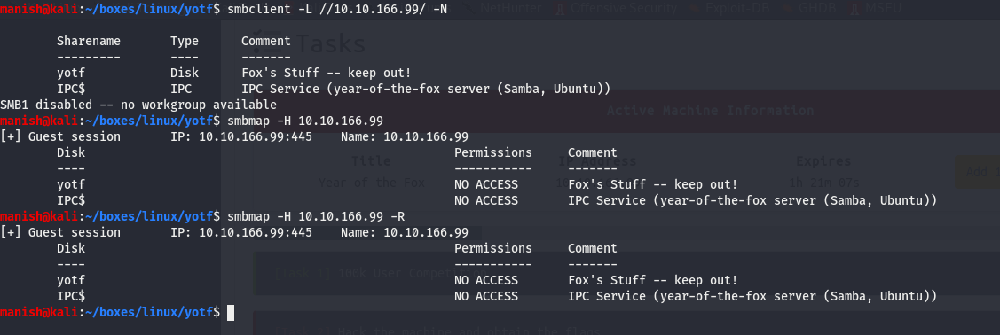

We find 2 shares yotf and IPC$.


## enum4linux

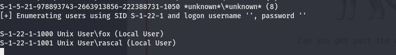

got 2 usernames

- fox
- rascal


#### credentials

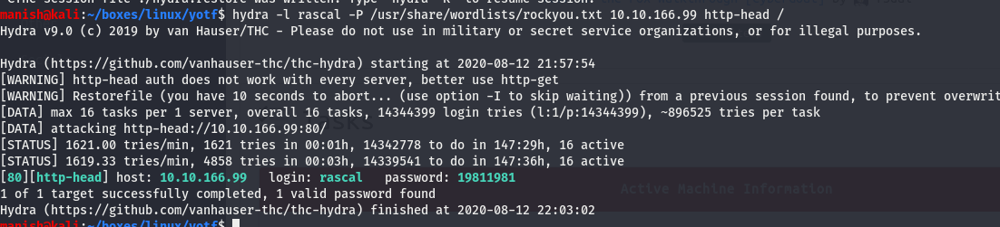

rascal 	19811981


## http Enumeration


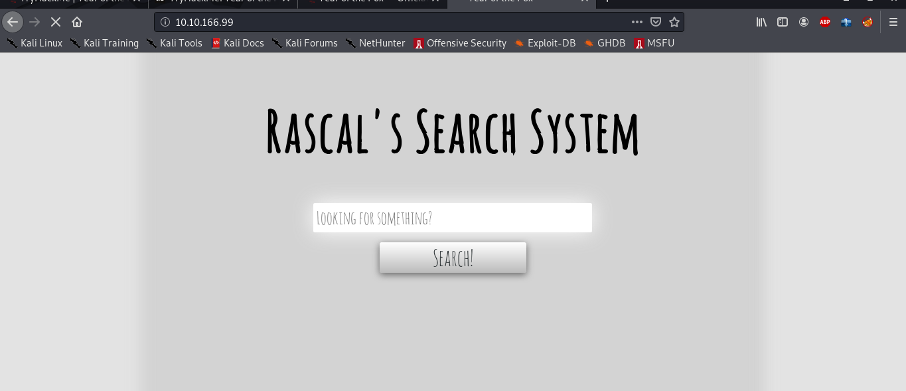


#### command injection

we find insecure deserialisation that is user input is not sanitized properly and it ran our query


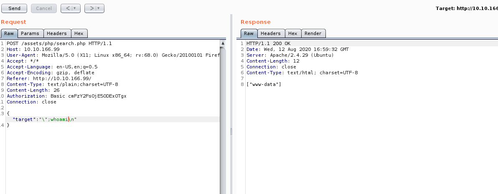


## Exploit


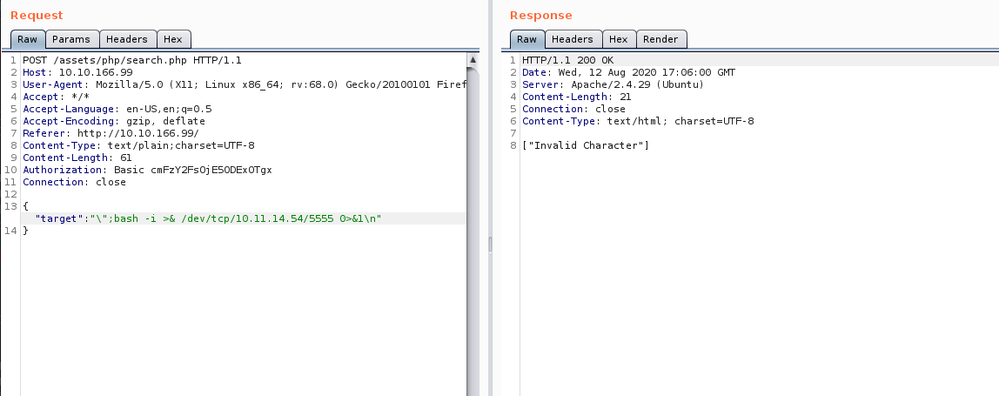

we have to use base64 encoder and then decode it when it reaches remote host


#### base64


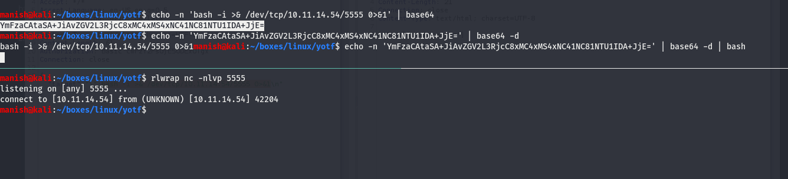

encoded the payload and we see it will work if  decode it and pipe it to bash


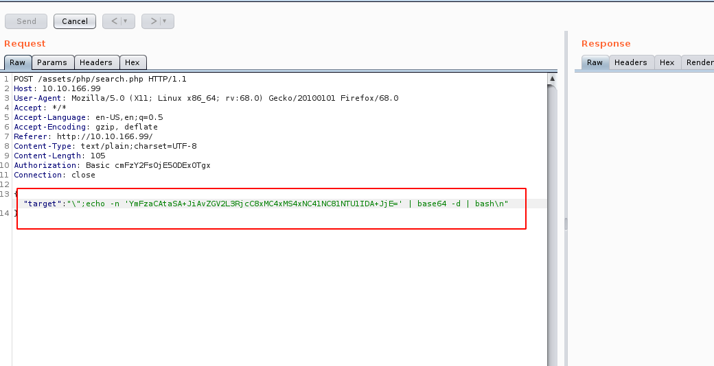


#### shell

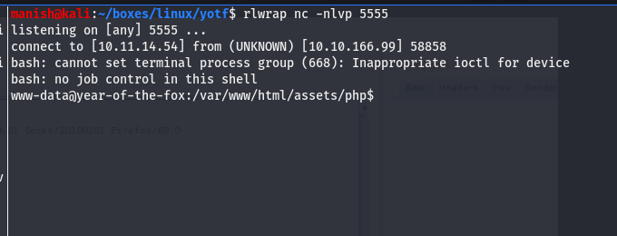


## port forwarding


we see ssh bind locally lets use socat to make a tunnel and forward all the traffic to someother port

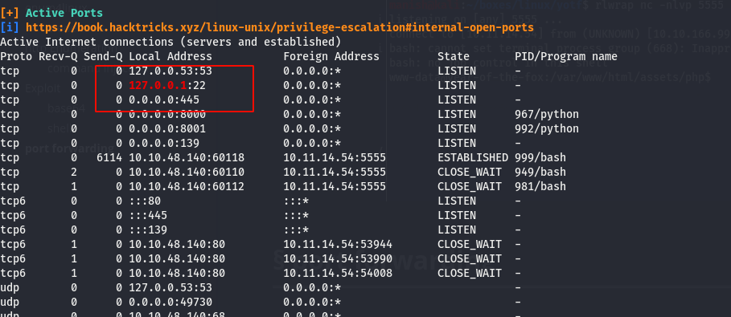


#### socat

we will use socat for port forwarding

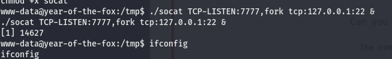

```bash
./socat TCP-LISTEN:7777,fork tcp:127.0.0.1:22 &
```


verifying the service is running on port 7777

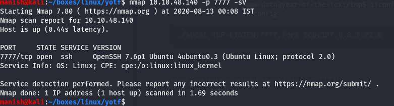


## ssh


#### bruteforce

we will try bruteforcing ssh

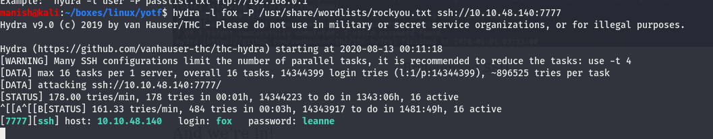

#### credentials

fox		leanne

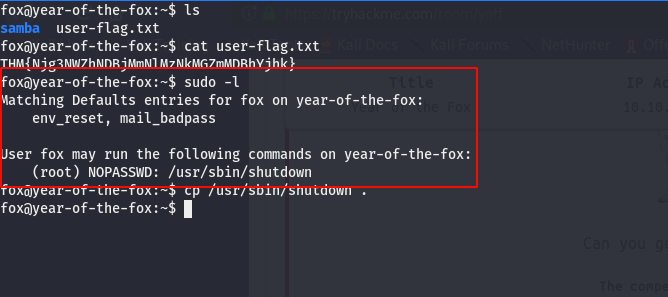


## Post


#### enumeration

sudo -l

we can see it has shutdown command with no passwd as root

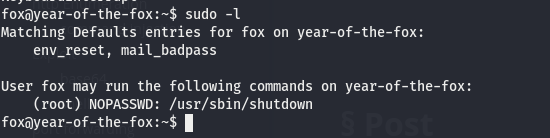


in the strings of shutdown command we see poweroff

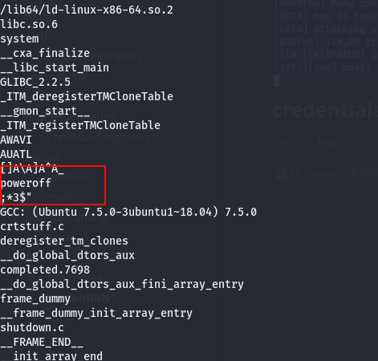


#### path manipulation


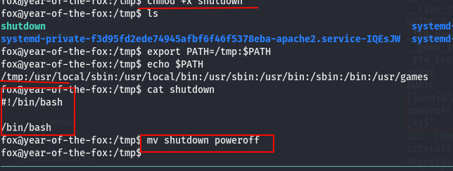


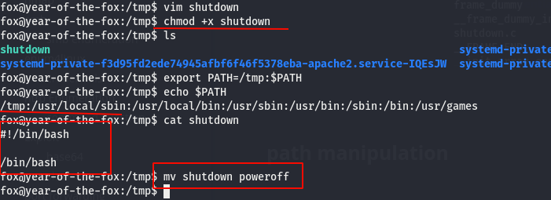


#### shell

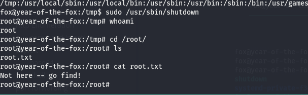

```
find -name "*root*"
```


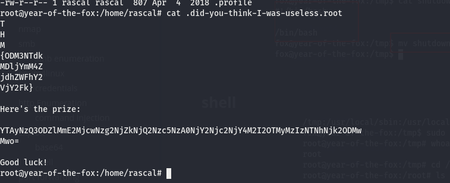

found the root flag