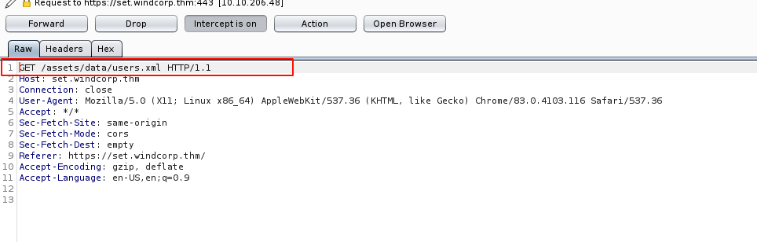
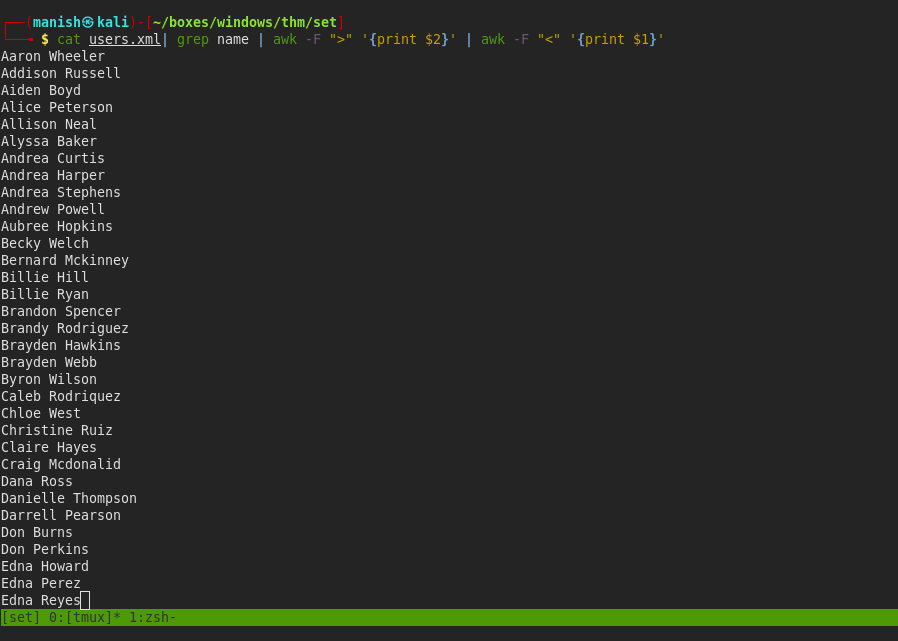
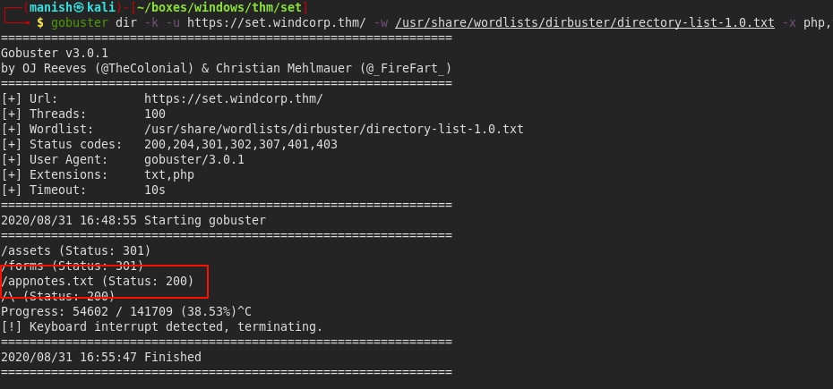
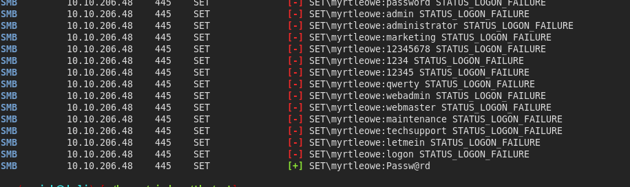
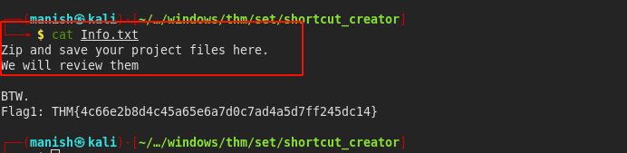
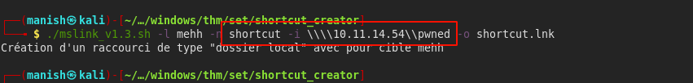
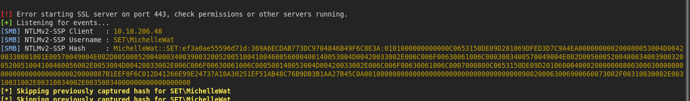
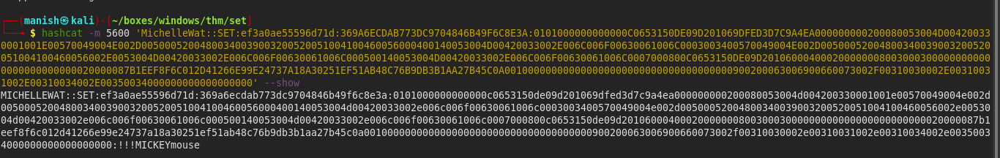
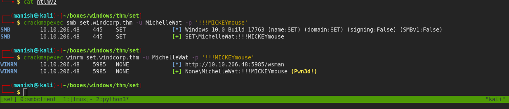

# Set


## nmap

PORT      STATE SERVICE       VERSION
135/tcp   open  msrpc         Microsoft Windows RPC
443/tcp   open  ssl/http      Microsoft HTTPAPI httpd 2.0 (SSDP/UPnP)
445/tcp   open  microsoft-ds?
5985/tcp  open  http          Microsoft HTTPAPI httpd 2.0 (SSDP/UPnP)
49666/tcp open  msrpc         Microsoft Windows RPC


443/tcp   open  ssl/http      Microsoft HTTPAPI httpd 2.0 (SSDP/UPnP)
|_http-server-header: Microsoft-HTTPAPI/2.0
|_http-title: Not Found
| ssl-cert: Subject: commonName=set.windcorp.thm
| Subject Alternative Name: DNS:set.windcorp.thm, DNS:seth.windcorp.thm
| Not valid before: 2020-06-07T15:00:22
|_Not valid after:  2036-10-07T15:10:21a
|_ssl-date: 2020-08-15T13:08:52+00:00; +4s from scanner time.
| tls-alpn: 
|_  http/1.1


## httpenumeration

- we see a search button when we search for something it queries a file.
- its location is **/assets/data/users.xml**




- its a xml file containing details abouts users and there contact info

```bash
cat users.xml| grep name | awk -F ">" '{print $2}' | awk -F "<" '{print $1}' | tee users.lst
```



- now we have a list of usernames we can try but we still need password




## crackmapexec

- in appnotes its written to change the password
- credentials are too common




#### credentials

myrtleowe				Passw@rd


## responder




- we see a message to zip file and send it for review we can send a shortcut lnk
- we can create link using a script [link](http://www.mamachine.org/mslink/index.en.html)



- we create a shortcut icon requesting us for icon.


#### ntlm hash

- we caught a hash



- its  NTLMv2 hash


#### hashcat



- credentials 

  SET\MichelleWat						!!!MICKEYmouse


## shell

- we got a shell using these credentials




## post 

- anitvirus is turned dont know how to bypass it still figuring it