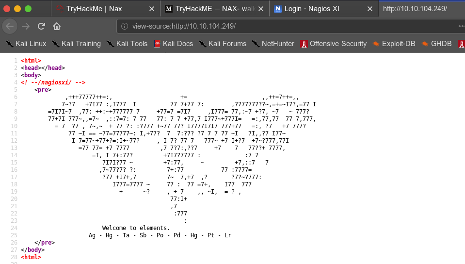
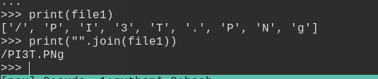

# nax


## nmap


PORT     STATE SERVICE    VERSION
22/tcp   open  ssh        OpenSSH 7.2p2 Ubuntu 4ubuntu2.8 (Ubuntu Linux; protocol 2.0)
| ssh-hostkey: 
|   2048 62:1d:d9:88:01:77:0a:52:bb:59:f9:da:c1:a6:e3:cd (RSA)
|   256 af:67:7d:24:e5:95:f4:44:72:d1:0c:39:8d:cc:21:15 (ECDSA)
|_  256 20:28:15:ef:13:c8:9f:b8:a7:0f:50:e6:2f:3b:1e:57 (ED25519)
25/tcp   open  smtp       Postfix smtpd
|_smtp-commands: ubuntu.localdomain, PIPELINING, SIZE 10240000, VRFY, ETRN, STARTTLS, ENHANCEDSTATUSCODES, 8BITMIME, DSN, 
| ssl-cert: Subject: commonName=ubuntu
| Not valid before: 2020-03-23T23:42:04
|_Not valid after:  2030-03-21T23:42:04
|_ssl-date: TLS randomness does not represent time
80/tcp   open  http       Apache httpd 2.4.18 ((Ubuntu))
|_http-server-header: Apache/2.4.18 (Ubuntu)
|_http-title: Site doesn't have a title (text/html).
389/tcp  open  ldap       OpenLDAP 2.2.X - 2.3.X
443/tcp  open  ssl/http   Apache httpd 2.4.18 ((Ubuntu))
|_http-server-header: Apache/2.4.18 (Ubuntu)
|_http-title: Site doesn't have a title (text/html).
| ssl-cert: Subject: commonName=192.168.85.153/organizationName=Nagios Enterprises/stateOrProvinceName=Minnesota/countryName=US
| Not valid before: 2020-03-24T00:14:58
|_Not valid after:  2030-03-22T00:14:58
|_ssl-date: TLS randomness does not represent time
| tls-alpn: 
|_  http/1.1
5667/tcp open  tcpwrapped
Service Info: Host:  ubuntu.localdomain; OS: Linux; CPE: cpe:/o:linux:linux_kernel


## httpenum


enumerating website we got some elements of periodic table



```
	Welcome to elements.
	Ag - Hg - Ta - Sb - Po - Pd - Hg - Pt - Lr
	47	 80	  73   51   84   46   80   78   103
```

- we will get responding numbers to elements
- then convert it from hex to ascii




```
PI3T.PNg
```

