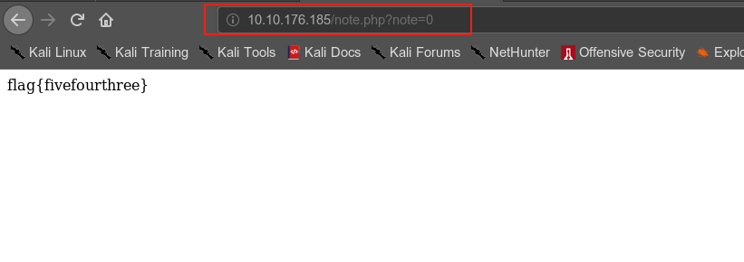
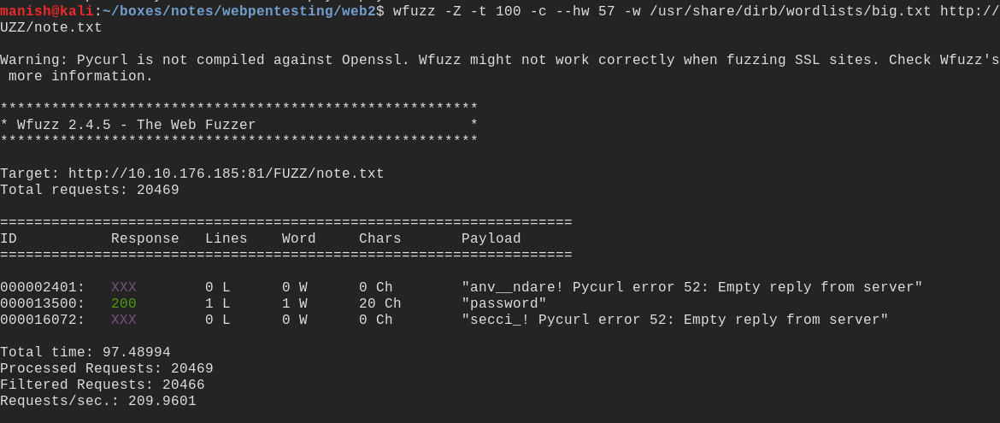
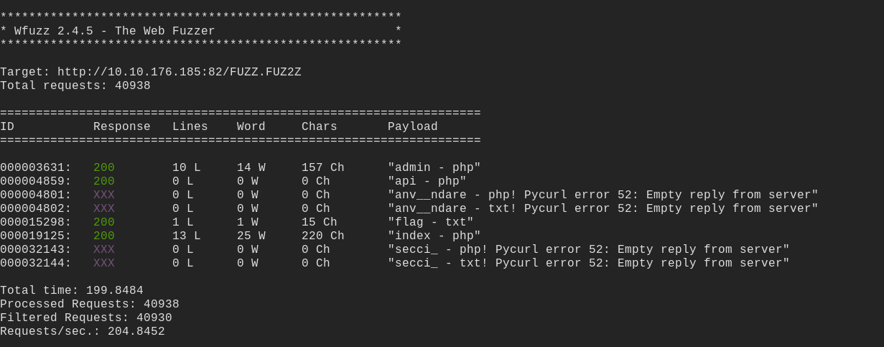

# web2


## nmap

PORT   STATE SERVICE VERSION
22/tcp open  ssh     OpenSSH 7.6p1 Ubuntu 4ubuntu0.3 (Ubuntu Linux; protocol 2.0)
| ssh-hostkey: 
|   2048 4b:81:7b:8f:60:6c:20:0d:04:0d:ef:ed:47:40:66:02 (RSA)
|   256 45:82:19:b2:7f:b7:36:36:ce:81:52:00:61:25:fd:90 (ECDSA)
|_  256 1a:3e:d8:f9:07:70:12:c9:59:69:75:02:8a:86:26:67 (ED25519)
80/tcp open  http    PHP cli server 5.5 or later (PHP 7.2.24-0ubuntu0.18.04.6)
|_http-title: Site doesn't have a title (text/html; charset=UTF-8).
81/tcp open  http    PHP cli server 5.5 or later (PHP 7.2.24-0ubuntu0.18.04.6)
|_http-title: Site doesn't have a title (text/html; charset=UTF-8).
82/tcp open  http    PHP cli server 5.5 or later (PHP 7.2.24-0ubuntu0.18.04.6)
|_http-title: Site doesn't have a title (text/html; charset=UTF-8).
Service Info: OS: Linux; CPE: cpe:/o:linux:linux_kernel


## IDOR

**insecure direct object reference**

```
IDOR, or Insecure Direct Object Reference, is the act of exploiting a misconfiguration in the way user input is handled, to access resources you wouldn't ordinarily be able to access.

For example, let's say we're logging into our bank account, and after correctly authenticating ourselves, we get taken to a URL like this https://example.com/bank?account_number=1234. On that page we can see all our important bank details, and a user would do whatever they needed to do and move along their way thinking nothing is wrong.

There is however a potentially huge problem here, a hacker may be able to change the account_number parameter to something else like 1235, and if the site is incorrectly configured, then he would have access to someone else's bank information.
```





## forced browsing


Forced browsing is the art of using logic to find resources on the  website that you would not normally be able to access. For example let's say we have a note taking site, that is structured like this. http://example.com/user1/note.txt. It stands to reason that if we did http://example.com/user2/note.txt we may be able to access user2's note. 

Taking this a step further, if we ran wfuzz on that url, we could enumerate  users we don't know about, as well as get their notes. This is quite  devastating, because we can then run further attacks on the users we  find, for example bruteforcing each user we find, to see if they have  weak passwords.


```
wfuzz -t 100 -c --sc 200 -w <wordlist> http://10.10.176.185:81/FUZZ/note.txt

-Z to bypass error
```




## API bypassing


This is a bit of a unique one, as it can basically be anything. APIs are by definition incredibly versatile, and finding out how to exploit  them, will require a lot of research and effort by the hacker. The  following situation is only one possible scenario out of a near infinite number.





